# Modelación Descriptiva (Aprendizaje no Supervisado)

## Definiciones {.smaller}

Aprendizaje No supervisado
: > Es un tipo de aprendizaje que no requiere de etiquetas (las respuestas correctas) para poder aprender. 

::: {.callout-note}
En nuestro caso nos enfocaremos en un caso particular de Modelación Descriptiva llamada Clustering.
:::

Clustering
: > Consiste en agrupar los datos en un menor número de `entidades` o `grupos`. A estos `grupos` se les conoce como `clusters` y pueden ser generados de manera global, o modelando las principales características de los datos. 


## Intuición {.smaller}

#### ¿Cuántos clusters se pueden apreciar?


::: {.r-stack}
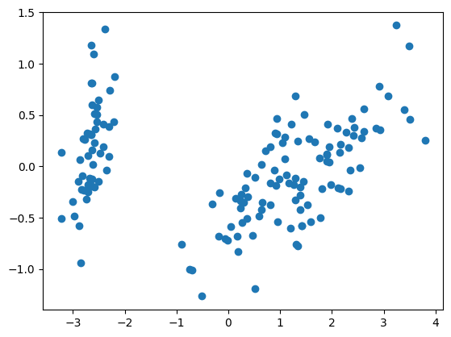{.lightbox fig-align="center" .fragment}

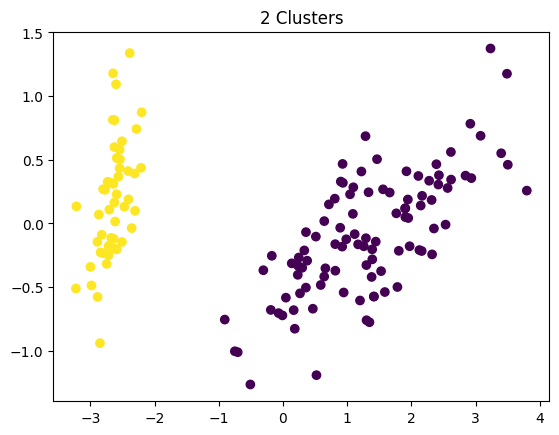{.lightbox fig-align="center" .fragment}

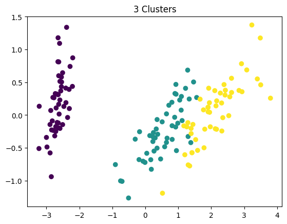{.lightbox fig-align="center" .fragment}
:::


# Clustering

## Clustering: Introducción

::: {.callout-note }
**Clustering**: Consiste en buscar grupos de objetos tales que la similaridad `intra-grupo` sea alta, mientras que la similaridad `inter-grupos` sea baja. Normalmente la distancia es usada para determinar **qué tan similares** son estos grupos. 
:::

::: {.columns}
::: {.column}
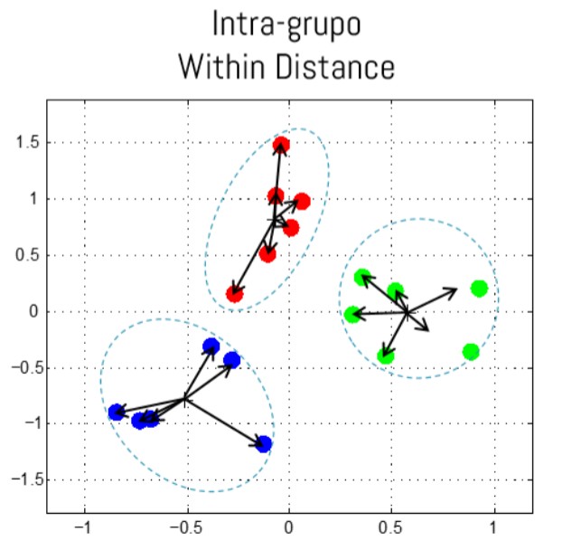{.lightbox fig-align="center" width="70%"}
:::
::: {.column}
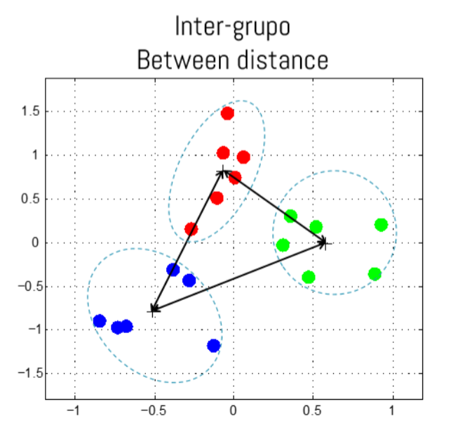{.lightbox fig-align="center" width="70%"}
:::
::: 

## Clustering: Evaluación {.smaller}

::: {.callout-important}
* Evaluar el nivel del éxito o logro del Clustering es complicado. **¿Por qué?**
:::


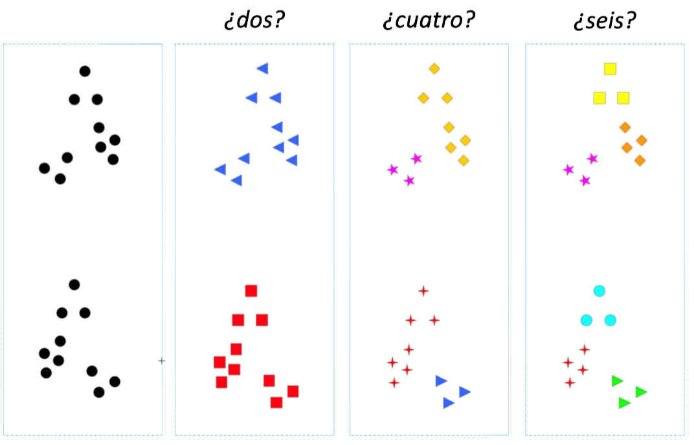{.lightbox fig-align="center" width="60%"}


## Clustering: Tipos

<br>

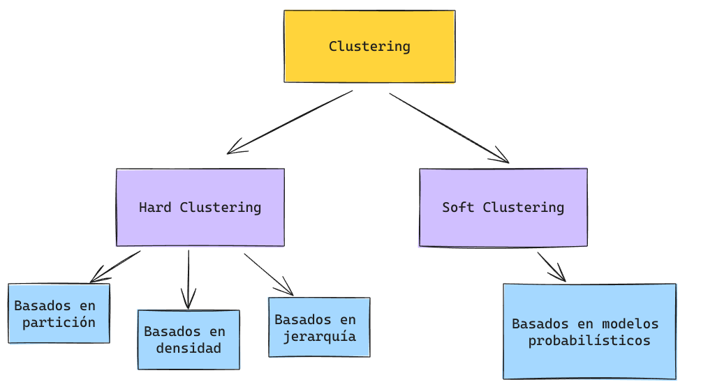{.lightbox fig-align="center" }


## Clustering: Partición

> Los datos son separados en `K` clusters, donde cada punto pertenece exclusivamente a un `único` cluster.

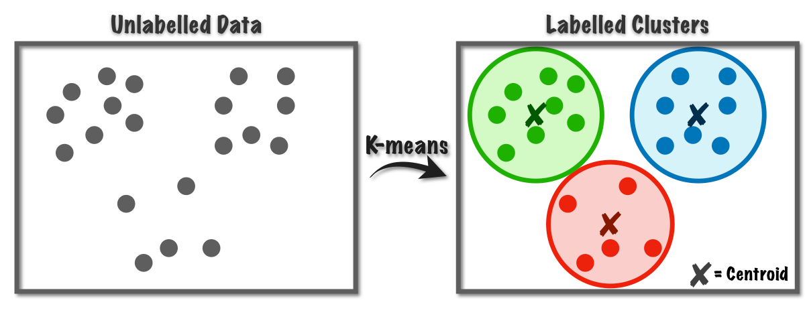{.lightbox fig-align="center" }

## Clustering: Densidad

> Se basan en la idea de continuar el crecimiento de un cluster a medida que la densidad (número de objetos o puntos) en el vecindario sobrepase algún umbral.

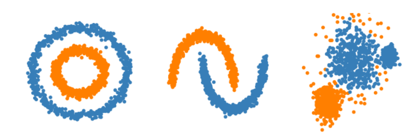{.lightbox fig-align="center" }

## Clustering: Jerarquía {.smaller}

> Los algoritmos basados en jerarquía pueden seguir 2 estrategias: 

* **Aglomerativos**: Comienzan con cada objeto como un grupo (bottom-up). Estos grupos se van combinando sucesivamente a través de una métrica de similaridad. `Para n objetos se realizan n-1 uniones`. 

* **Divisionales**: Comienzan con un solo gran cluster (bottom-down). Posteriormente este mega-cluster es dividido sucesivamente de acuerdo a una métrica de similaridad. 


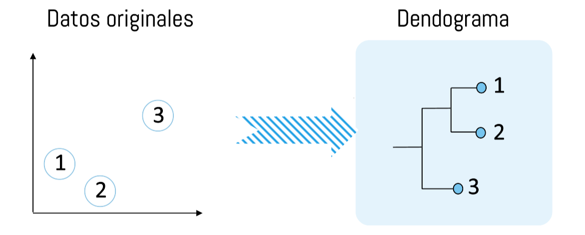{.lightbox fig-align="center" width="70%"}


## Clustering: Probabilístico {.smaller}

Se ajusta cada punto a una distribución de probabilidades que indica cuál es la probabilidad de pertenencia a dicho cluster. 

::: {.columns}
::: {.column}
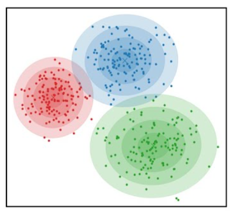{.lightbox fig-align="center" width="80%"}
:::
::: {.column}
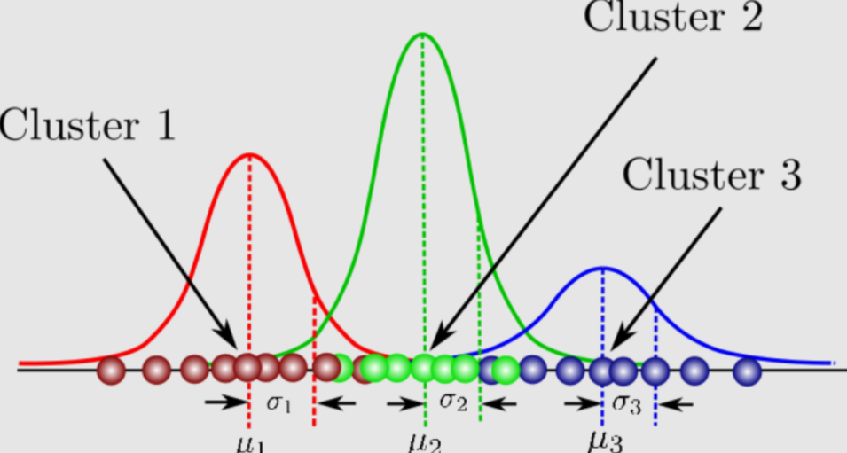{.lightbox fig-align="center" }
:::
::: 

# Métodos Basados en Partición

## Partición

> Los datos son separados en `K` Clusters, donde cada punto pertenece exclusivamente a un único cluster. A `K` se le considera como un `hiperparámetro`.

::: {.callout-tip}
* Cluster Compactos: Minimizar la `distancia intra-cluster` (within cluster). 
* Clusters bien separados: Maximizar la `distancia inter-cluster` (between cluster).
:::

$$ Score (C,D) = f(wc(C),bc(C))$$

El puntaje/score mide la calidad del clustering $C$ para el Dataset $D$. 

## Score

$$ Score (C,D) = f(wc(C),bc(C))$$

<br>

::: {.columns style="font-size: 70%;"}
::: {.column}
* Distancia Between-Cluster:
  $$bc(C) = \sum_{1 \le j \le k \le K} d(r_j, r_k)$$
  

donde $r_k$ representa el centro del cluster $k$:
  $$r_k = \frac{1}{n_k} \sum_{x_i \in C_k} x_i$$

:::
::: {.column}
* Distancia Within-Cluster (Inercia):
  $$wc(C) = \sum_{k=1}^K \sum_{x_i \in C_k} d(x_i, r_k)$$

:::
::: 

::: {.columns}
::: {.column style="font-size: 70%;"}
::: {.callout-tip}
Distancia entre los centros de cada cluster.
:::
:::
::: {.column style="font-size: 70%;"}
::: {.callout-tip}
Distancia entre todos los puntos del cluster y su respectivo centro. 
:::
:::
::: 

## K-Means {.smaller}

K-Means
: > Dado un número de clusters $K$ (determinado por el usuario), cada cluster es asociado a un centro (centroide). Luego, cada punto es asociado al cluster con el centroide más cercano. 

::: {.columns}
::: {.column}
{.lightbox fig-align="center" width="90%"}
:::
::: {.column}
Normalmente se utiliza la Distancia Euclideana como medida de `similaridad`.

::: {.incremental}
1. Se seleccionan $K$ puntos como centroides iniciales.
2. Repite:
   - Forma K clusters asignando todos los puntos al centroide más cercano. 
   - Recalcula el centroide para cada clase como la media de todos los puntos de dicho cluster.
- Se repite este procedimiento por un **número finito de iteraciones** o hasta que los **centroides no cambien**.  
:::
:::
::: 


## K-Means: Ejemplo {.smaller}

#### Resolvamos el siguiente ejemplo. 

Supongamos que tenemos tipos de manzana, y cada una de ellas tiene 2 atributos (features). Agrupemos estos objetos en 2 grupos de manzanas basados en sus características. 

::: {.columns}
::: {.column}
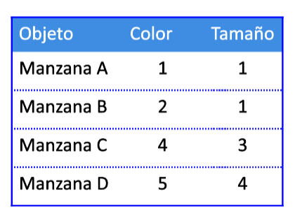{.lightbox fig-align="center"} 
:::
::: {.column}
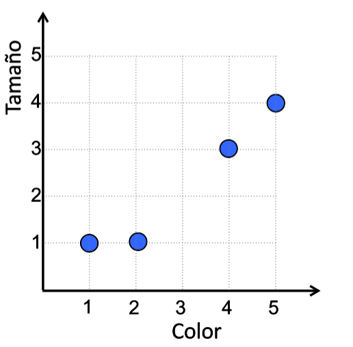{.lightbox fig-align="center"} 
:::
::: 


## K-Means: Ejemplo {.smaller}

#### 1era Iteración

::: {.columns}
::: {.column}
::: {.fragment fragment-index=1}
* Supongamos los siguientes centroides iniciales: 
$$C_1 = (1,1)$$
$$C_2 = (2,1)$$
:::

:::{.callout-note .fragment fragment-index=2}
Matriz de Distancias al Centroide: (coordenada `i,j` representa distancia  del punto `j` al centroide `i`)
:::

::: {.fragment fragment-index=2}
$$D^1 = \begin{bmatrix}
0 & 1 & 3.61 & 5\\
1 & 0 & 2.83 & 4.24
\end{bmatrix}$$
:::

::: {.fragment fragment-index=3}
* Calculemos la Matriz de Pertenencia $G$: 
:::

::: {.fragment fragment-index=4}
$$G^1 = \begin{bmatrix}
1 & 0 & 0 & 0 \\
0 & 1 & 1 & 1
\end{bmatrix}$$
:::
:::
::: {.column .fragment fragment-index=1}
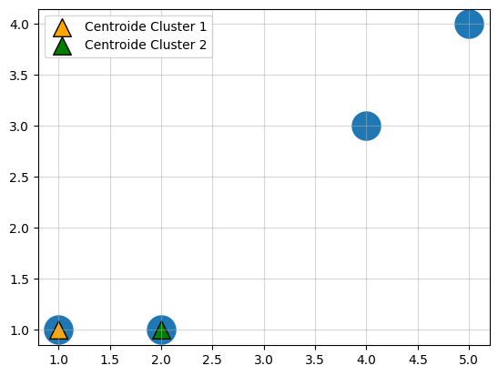{.lightbox fig-align="center"}

::: {.fragment fragment-index=5}

Los nuevos centroides son:
$$C_1 = (1,1)$$
$$C_2 = (\frac{11}{3}, \frac{8}{3})$$
:::

:::

::: 


## K-Means: Ejemplo {.smaller}

#### 2da Iteración

::: {.columns}
::: {.column}
::: {.fragment fragment-index=1}
* Los nuevos centroides son:

$$C_1 = (1,1)$$
$$C_2 = (\frac{11}{3}, \frac{8}{3})$$
:::

::: {.fragment fragment-index=2}
* Calculamos la Matriz de Distancias al Centroide:
:::

::: {.fragment fragment-index=2}
$$D^2 = \begin{bmatrix}
0 & 1 & 3.61 & 5\\
3.14 & 2.26 & 0.47 & 1.89
\end{bmatrix}$$
:::

::: {.fragment fragment-index=3}
* Calculemos la Matriz de Pertenencia $G$: 
:::

::: {.fragment fragment-index=4}
$$G^2 = \begin{bmatrix}
1 & 1 & 0 & 0 \\
0 & 0 & 1 & 1
\end{bmatrix}$$
:::
:::
::: {.column .fragment fragment-index=1}
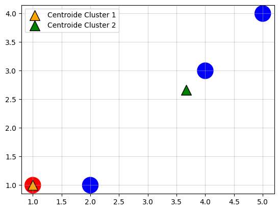{.lightbox fig-align="center"}

::: {.fragment fragment-index=5}

Los nuevos centroides son:
$$C_1 = (1,1)$$
$$C_2 = (\frac{9}{2}, \frac{7}{2})$$
:::

:::

::: 

## K-Means: Ejemplo {.smaller}

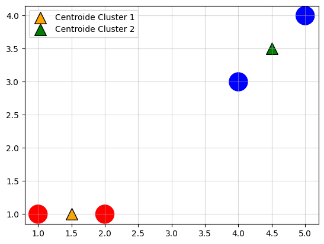{.lightbox fig-align="center"}

::: {.callout-tip}
* Si seguimos iterando notaremos que ya no hay cambios en los clusters. El algoritmo converge. 
* Este es el resultado de usar $K=2$. Utilizar otro valor de $K$ entregará valores distintos. 
* **¿Es este el número de clusters óptimos?**
:::

## K-Means: Número de Clusters Óptimos {.smaller}

::: {.columns}
::: {.column width="70%"}
::: {.r-stack}

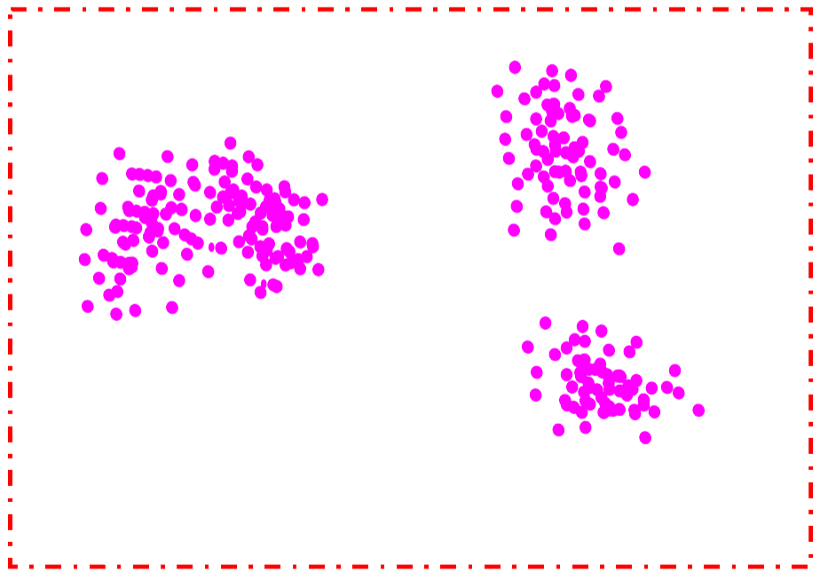{.lightbox fig-align="center" .fragment .fade-in-then-out}

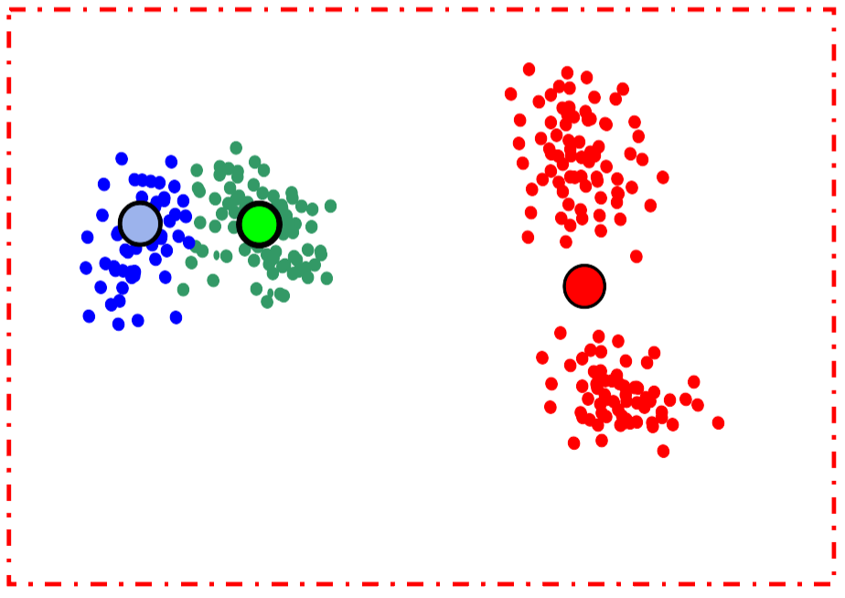{.lightbox fig-align="center" .fragment}
:::
:::
::: {.column width="30%"}
::: {.callout-caution .fragment}
* Siempre es posible encontrar el número de clusters indicados. 
* Entonces, 

**¿Cómo debería escoger el valor de $K$?**
:::
:::
::: 

## K-Means: Número de Clusters Óptimos {.smaller}

Curva del Codo
: Es una heurísitca en la cual gráfica el valor de una métrica de distancia (e.g. within distance) para distintos valores de $K$. El valor óptimo de $K$ será el codo de la curva, que es el valor donde se estabiliza la métrica. 

::: {.columns}
::: {.column}
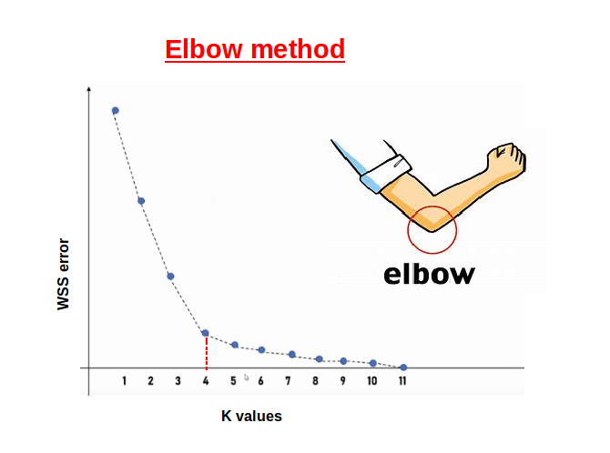{.lightbox fig-align="center"} 
:::
::: {.column}
<br>

::: {.callout-important .fragment}
* Este valor del codo muchas veces es subjetivo y distintas apreciaciones pueden llegar a distintos $K$ óptimos. 
:::

::: {.callout-tip .fragment}
Eventualmente otras métricas distintas al `within distance` podrían también ser usadas. 
:::
:::
::: 

## K-Means: Detalles Técnicos

::: {.callout-note appearance="default"}
## Fortalezas

* Algoritmo relativamente eficiente ($O(k \cdot n \cdot i)$). Donde $k$ es el número de clusters, $n$ el número de puntos, e $i$ el número de iteraciones. 
* Encuentra ***"clusters esféricos"***. 
:::

::: {.callout-warning appearance="default"}
## Debilidades

* Sensible al punto de inicio. 
* Solo se puede aplicar cuando el promedio es calculable. 
* Se requiere definir K a priori (K es un *hiperparámetro*). 
* Suceptible al ruido y a mínimos locales (podría no converger). 

:::

## Implementación en Scikit-Learn

```{.python code-line-numbers="|1|3|4|5|7-8|"}
from sklearn.cluster import KMeans

km = KMeans(n_clusters=8, n_init=10,random_state=None)
km.fit(X)
km.predict(X)

## opcionalmente
km.fit_predict(X)
```

::: {.columns style="font-size: 70%;"}
* **n_clusters**: Define el número de clusters a crear, por defecto 8.
*  **n_init**: Cuántas veces se ejecuta el algoritmo, por defecto 10.
*  **random_state**: Define la semilla aleatoria. Por defecto sin semilla.
*  **init**: Permite agregar centroides de manera manual.

* `.fit()`: Entrenará el modelo en los datos suministrados. 
* `.predict()` Entregará las clusters asignados a cada dato suministrado. 
* `.clusters_centers_`: Entregará las coordenadas de los centroides de cada Cluster.
:::

👀 Veamos un ejemplo en Colab.

## Sugerencias

::: {.callout-important appearance="default"}
## Pre-procesamientos

Es importante recordar que K-Means es un Algoritmo basado en `distancias`, por lo tanto se ve afectado por Outliers y por Escalamiento. 

Se recomienda preprocesar los datos con:

* `Winsorizer()` para eliminar Outliers.
* `StandardScaler()` o `MinMaxScaler()` para llevar a una escala común. 
:::

## Interpretación Clusters

::: {.callout-note}
Recordar, que el clustering no clasifica. Por lo tanto, a pesar de que K-Means nos indica a qué cluster pertenece cierto punto, debemos interpretar cada cluster para entender `qué es lo que se agrupó`.
:::

:::::: {.callout-caution}
La interpretación del cluster es principalmente intuición y exploración, por lo tanto el EDA puede ser de utilidad para analizar clusters.
:::

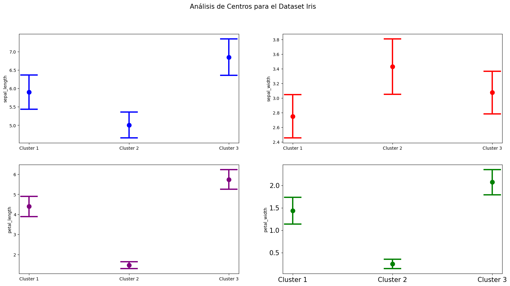{.lightbox fig-align="center"}

## Post-Procesamiento: Merge {.smaller}

Post-Procesamiento
: > Se define como el `tratamiento` que podemos realizar al algoritmo luego de haber entregado ya sus predicciones. 

Es posible generar *más clusters* de los necesarios y luego ir agrupando los más cercanos.

::: {.columns}
::: {.column}
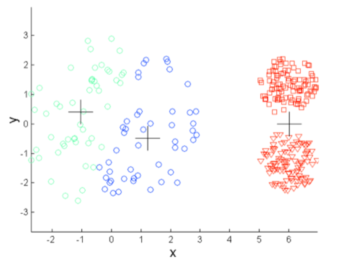{.lightbox fig-align="center" }
:::
::: {.column}
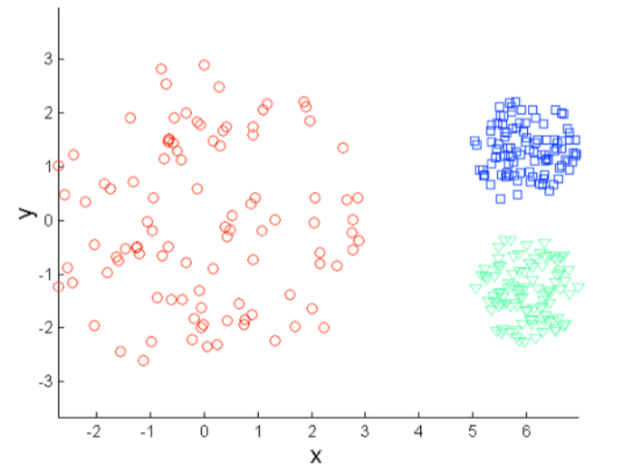{.lightbox fig-align="center" .fragment}
:::
::: 

## Post-Procesamiento: Merge

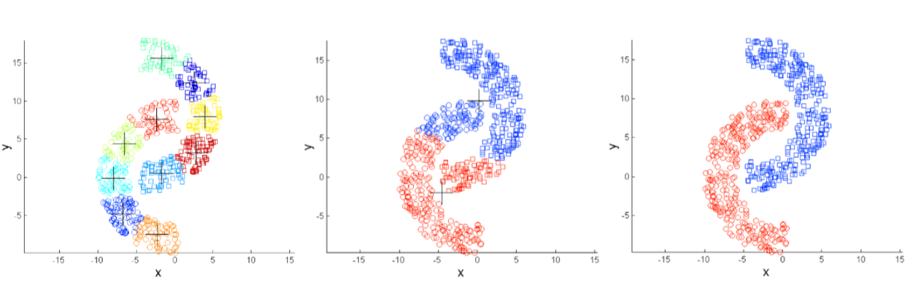{.lightbox fig-align="center" }

::: {.callout-warning .fragment}
**¿Cuál es el problema con este caso de Post-Procesamiento?**
:::

## Post-Procesamiento: Split 

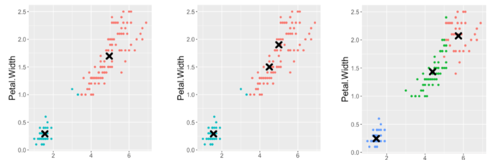{.lightbox fig-align="center" }

::: {.callout-note}
En `Scikit-Learn` esto puede conseguirse utilizando el parámetro **init**. Se entregan los nuevos centroides para `forzar` a K-Means que separe ciertos clusters.
:::

## Variantes K-Means

::: {.columns}
::: {.column}
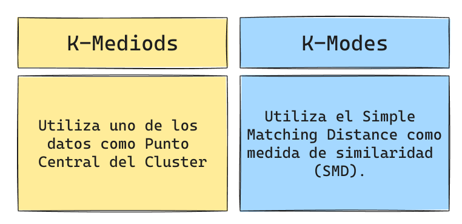{.lightbox fig-align="center" }
:::
::: {.column}
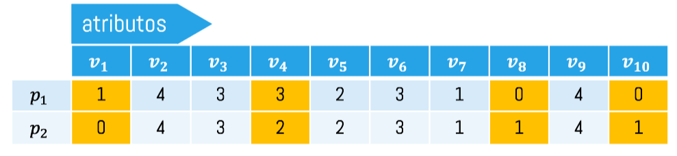{.lightbox fig-align="center" }

$$SMD(p_1,p_2) = 4$$
:::
::: 

::: {.callout-tip}
[Acá](https://pypi.org/project/kmodes/) pueden encontrar una implementación de K-Modes en Python.
:::


# That's all Folks

::: {.footer}
<p xmlns:cc="http://creativecommons.org/ns#" xmlns:dct="http://purl.org/dc/terms/"><span property="dct:title">Tics-411 Minería de Datos</span> está licenciado bajo <a href="http://creativecommons.org/licenses/by-nc-sa/4.0/?ref=chooser-v1" target="_blank" rel="license noopener noreferrer" style="display:inline-block;">CC BY-NC-SA 4.0

</a></p>
:::