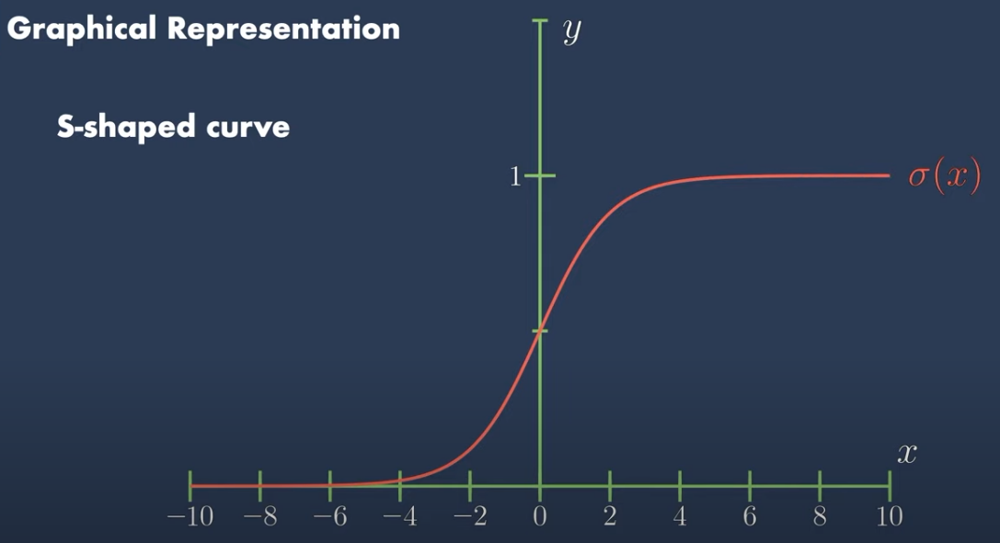
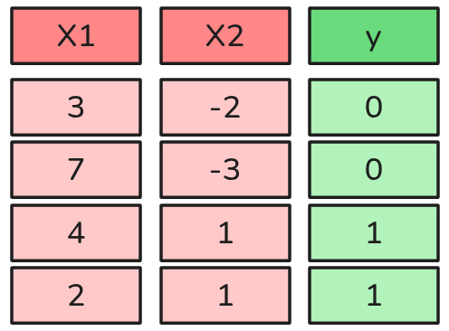
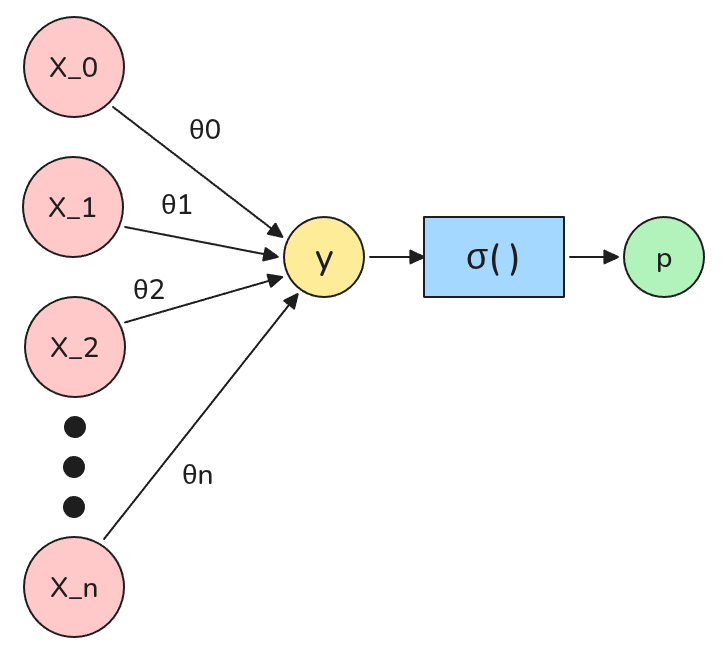
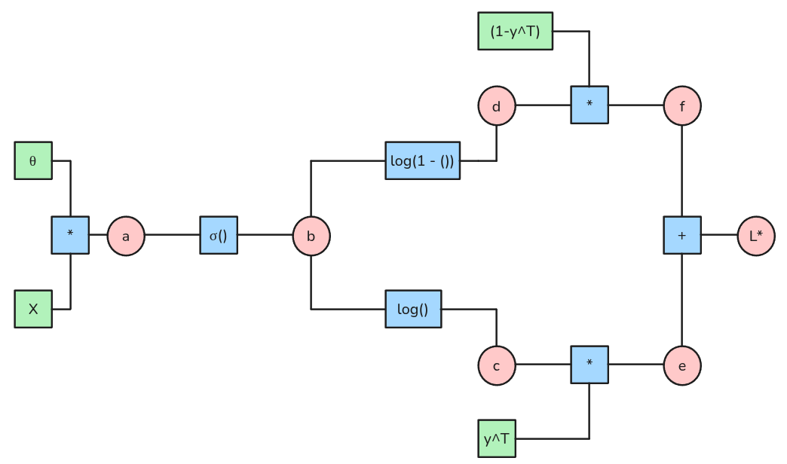
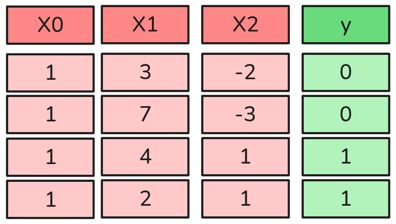

# Shallow Models

## Modelo Básico de Clasificación Binaria {.smaller}

Supongamos el siguiente problema de clasificación binaria:

::: {.callout-note appearance="default" .fragment}
## Sea $\mathcal{y} \sim \text{Bernoulli}(p)$, es decir:
$$P(y) = \begin{cases}
p,  & \text{si y = 1} \\
1-p, & \text{si y=0}
\end{cases}
$$
:::

:::{.callout-important appearance="default" .fragment}
## Pero Ojo 👀 
¿Cómo estimamos la probabilidad $p$ para asignar una clase?

*  Esta clase puede ser cualquier cosa, por ejemplo, si un correo es spam o no, si es un gato o u perro, etc.
:::

:::{.callout-tip appearance="default" .fragment}
## Regresión Lineal
Una manera es utilizar una combinación lineal de features (inputs) y parámetros (pesos). Es decir:

$$\hat{y} = \theta_0 x_0 + \theta_1 x_1 + ... + \theta_n x_n$$
:::

## Modelo Básico de Clasificación Binaria {.smaller}

> Pero tenemos el problema de que $y$ puede tomar cualquier valor real (no está acotada), y necesitamos que $p$ esté entre 0 y 1. Para ello podemos aplicar la función Logística o Sigmoide.

::::{.columns}
:::{.column}
{.lightbox fig-align="center" width="80%"}
:::
:::{.column}
:::{.callout-warning appearance="default" icon=false}
## 👍 Propiedades de la función Sigmoide

* Acotada entre 0 y 1. 
* Punto de Inflexión en $x=0$, lo que se transforma en $p=0.5$.
* $\sigma(z)'= \sigma(z)(1-\sigma(z))$.
:::

:::{.callout-tip appearance="default" icon=false}
## Estimación de la probabilidad
$$ p = \sigma(\hat{y}) = \sigma(\theta_0 x_1 + \theta_1 x_1 + ... + \theta_n x_n)$$

donde $\sigma(x) = \frac{1}{1 + e^{-x}}$ es la función sigmoide.
:::
:::
::::

## Modelo Básico de Clasificación Binaria {.smaller}

::::{.columns}
:::{.column width="40%"}
{.lightbox fig-align="center" width="80%"}

:::{.callout-warning appearance="default" icon=false .fragment fragment-index=1}
## 🤓 Más definiciones
* Llamaremos parámetros a los valores $\theta_j$, $j=0,...,n$.
* Llamaremos **"Capas"** a un conjunto de parámetros utilizado para generar un resultado.
:::
:::
:::{.column width="60%"}
:::{.callout-warning appearance="default" icon=false}
## 🤓 Definiciones

* Definiremos $(\bar{x}^{(i)})^T = (x_1^{(i)}, x_2^{(i)}, ..., x_n^{(i)})$ como el vector de features del punto $i$.
* Asimismo $y^{(i)}$ será el label/etiqueta del punto $i$.
* En este caso particular $m=3$ observaciones y $n=2$ features.

:::
:::{.callout-important appearance="default" .fragment fragment-index=2}
## Redes Neuronales
El término Red Neuronal es un término marketero, lo único que hace es mostrar de manera gráfica lo que nosotros acabamos de definir.

{.lightbox fig-align="center" width="50%"}

:::
:::
::::

## Red Neuronal Básica: Regresión Logística {.smaller}

Finalmente, por conveniencia, podemos escribir nuestra Regresión Logísitca en notación matricial: 

:::{.callout-note appearance="default" style="font-size: 130%;"}
## Una observación
$$p^{(i)} = \sigma((\bar{x}^{(i)})^T \cdot \theta)$$
:::

:::{.callout-tip appearance="default" style="font-size: 130%;"}
### Muchas Observaciones
$$\bar{p} = \sigma(X \cdot \theta)$$

Donde X es el la ***Matriz de Diseño/Design Matrix***, que contiene todos los vectores de features.
Además utilizaremos la definición inicial, en la que si $p\ge 0.5$ entonces $y=1$ y si $p < 0.5$ entonces $y=0$.
:::

## Los Ingredientes de un Algoritmo de Aprendizaje {.smaller}

Hipótesis
: > Una función que describe como mapear inputs (features) con outputs (labels) por medio de parámetros. En nuestro caso inicial diremos que $h_\theta(X) = \sigma(X \theta)$, donde $\sigma$ es la función sigmoide.

Loss Function
: > Una función que especifica cuanta información se pierde. Mayor pérdida implica más error de estimación.

Método de Optimización
: > Es el responsable de combinar la `hipótesis` y la `loss function`. Corresponde a un procedimiento para determinar los parámetros de la hipótesis, minimizando la suma de las pérdidas en un set de entrenamiento. 

## Regresión Logística: Loss Function {.smaller}

::::{style="font-size: 70%;"}
Nuestra definición inicial de la Distribución Bernoulli puede ser rescrita de la siguiente manera:

::::{.columns} 
:::{.column}
$$P(y) = \begin{cases}
p,  & \text{si y = 1} \\
1-p, & \text{si y=0}
\end{cases}
$$
:::
:::{.column}
$$P(y|X) = p^{y} (1-p)^{1-y}$$
:::
::::
::::

:::{.callout-note appearance="default" style="font-size: 110%;"}
## Maximum Likelihood Estimation
Permite estimar los parámetros $\theta$ que maximizan la probabilidad de observar los datos disponibles. De esta forma, la likelihood puede utilizarse como una medida de qué tan bien el modelo se ajusta a los datos.
$$\mathcal{L}(\theta) = \prod_{i=1}^m P(y^{(i)}|X^{(i)}) = \prod_{i=1}^m p^{y^{(i)}} (1-p)^{1-y^{(i)}}$$
:::

:::{.callout-important appearance="default" style="font-size: 110%;"}
## Negative Log Likelihood
* La Productoria no es amigable. 
* Es más común minimizar que maximizar. Además esto se puede interpretar como **minimizar el error**. 
* Aplicamos Logaritmo a la función de verosimilitud y cambiamos el signo. 

$$\mathcal{l}(\theta) = -\log(\mathcal{L}(\theta)) = -\sum_{i=1}^m \left(y^{(i)} \log(p^{(i)}) + (1-y^{(i)}) \log(1-p^{(i)})\right)$$
:::

## Regresión Logística: Loss Function {.smaller}

:::{.callout-important appearance="default" icon=false}
## Función de Pérdida/Loss Function en notación matricial
$$L(\theta) = -\frac{1}{m}\left[y^T \log(\bar{p}) + (1-y)^T \log(1-\bar{p})\right]$$

donde $\bar{p} = \sigma(X\theta)$ es el vector de probabilidades estimadas por el modelo.

* **Atención**: Es más común calcular la pérdida promedio, es decir, dividir por $m$.
:::

:::{.callout-warning appearance="default" icon=false}
## Propiedades
* Si $y^{(i)} = 1$, entonces $L(\theta) = -\frac{1}{m}log(p^{(i)})$.
  * Luego si la probabilidad es cercana a 1, que significa que el modelo predijo correctamente la clase, entonces la pérdida es cercana a 0.
  * Pero si la probabilidad es cercana a 0, entonces la pérdida es alta.
* Si $y^{(i)} = 0$, entonces $L(\theta) = -\frac{1}{m}log(1-p^{(i)})$.
  * Luego si la probabilidad es cercana a 0, que significa que el modelo predijo correctamente la clase, entonces la pérdida es cercana a 0.
  * Pero si la probabilidad es cercana a 1, entonces la pérdida es alta.
:::

:::{.callout-note appearance="default" icon=false} 
### Conclusión
* La Función de Pérdida mide cuánta información se pierde al estimar los parámetros $\theta$. En otras palabras, mide el error de estimación de nuestro modelo. Por lo tanto, una **Loss Function** más baja implica un mejor modelo.

* Si minimizamos nuestra función de pérdida, entonces estamos maximizando la probabilidad de observar los datos. Por lo tanto, minimizamos el error de estimación del modelo.

:::

## Regresión Logística: Método de Optimización 

::::{style="font-size: 80%;"}
:::{.callout-warning appearance="default" icon=false}
## 🤘 Debemos encontrar qué parámetros $\theta$ son los que minimizan el error del modelo. Para ello basta con resolver el siguiente problema de optimización:

$$\underset{\theta}{argmin} = L(\theta)$$

* Lo cuál puede ser resuelto fácilmente utilizando un método de optimización como el **Gradient Descent**.
:::

:::{.callout-note appearance="default" appearance="default"}
## Parámetros óptimos se encuentran con:
$$\theta = \theta - \alpha \nabla_\theta L(\theta)$$
:::

:::{.callout-important appearance="default" icon=false}
## 😇 ¿Cuánto vale el gradiente de la Función de Pérdida?
::::{.columns}
::::{.column}
Vamos a calcular el gradiente haciendo trampa. Puede que algunos se enojen, pero para nosotros es suficiente.
:::
::::{.column}
{.lightbox fig-align="center" width="30%"} 
:::
::::
:::
::::

## Regresión Logísitca: Gradiente {.smaller}

::::{.columns}
:::{.column width="30%"}
Supongamos lo siguiente:

* $a= X \theta$
* $b = \sigma(a)$
* $c = log(b)$
* $d = log(1-b)$
* $e = y^T c$
* $f = (1-y)^T d$
* $L* = e + f$
* $L = -\frac{1}{m} L*$
:::
::::{.column width="70%"}
{.lightbox fig-align="center" width="90%"}
:::
::::

## Regresión Logísitca: Calculando el Gradiente {.smaller}

$$
\begin{align*}
\frac{\partial L*}{\partial f} &= \frac{\partial L}{\partial e} = 1 \\
\frac{\partial L*}{\partial d} &= \frac{\partial L}{\partial f} \cdot \frac{\partial f}{\partial d} = (1 - y)^T \\
\frac{\partial L*}{\partial c} &= \frac{\partial L}{\partial e} \cdot \frac{\partial e}{\partial c} = y^T \\
  \frac{\partial L*}{\partial b} &= \frac{\partial L}{\partial c} \cdot \frac{\partial c}{\partial b}  + \frac{\partial L}{\partial d} \cdot \frac{\partial d}{\partial b}= \frac{y^T}{b} - \frac{(1-y)^T}{1-b} \\
\frac{\partial L*}{\partial a} &= \frac{\partial L}{\partial b} \cdot \frac{\partial b}{\partial a} = \left[\frac{y^T}{b} - \frac{(1-y)^T}{1-b}\right] \cdot \sigma(a)' \\
\frac{\partial L*}{\partial \theta} &= \frac{\partial L}{\partial a} \cdot \frac{\partial a}{\partial \theta} = \left[\frac{y^T}{b} - \frac{(1-y)^T}{1-b}\right] \cdot \sigma(a)' \cdot X\\
\frac{\partial L*}{\partial \theta} &=\left[\frac{y^T (1-b) - b (1-y)^T}{b(1-b)}\right] \cdot \sigma(a)' \cdot X\\
\frac{\partial L*}{\partial \theta} &=\left[\frac{y^T - b}{b(1-b)}\right] \cdot \sigma(a)' \cdot X\\
\end{align*}
$$

## Regresión Logísitca: Gradiente {.smaller}

$$\frac{\partial L*}{\partial \theta} =\left[\frac{y^T - b}{b(1-b)}\right] \cdot \sigma(a)' \cdot X$$

Luego reemplazamos que $b=\sigma(a)$ y $\sigma(a)'=\sigma(a)(1-\sigma(a))$:

Obtenemos que:

$$\frac{\partial L}{\partial \theta} = \frac{1}{m}\left[\sigma(X\theta)_{m \times 1} - y^T_{1 \times m}\right]X_{m \times (n+1)}$$

::::{.columns}
:::{.column}
:::{.callout-important appearance="default" icon=false}
### 😅Ojo con las dimensiones.
Debemos modificar nuestro cálculo de modo que las dimensiones sean compatibles. Luego: 

$$\frac{\partial L}{\partial \theta}_{(n+1) \times 1} = \frac{1}{m}  X^T_{(n+1) \times m} \cdot \left[\sigma(X\theta) - y\right]_{m \times 1}$$

* Tengo que tener un gradiente para cada parámetro (***¿por qué son $n+1$?***)
:::
:::
:::{.column .fragment}

{.lightbox fig-align="center" width="70%"}

:::
::::

## Regresión Logística: Update Rule {.smaller}

> Llamaremos Update Rule al Algoritmo que permite ***entrenar un modelo***. En el caso de la Regresión Logística, el Update Rule es:

:::{style="font-size: 130%;"}

$$\theta_{n+1 \times 1} = \theta_{n+1 \times 1} - \frac{\alpha}{m} \cdot X^T_{(n+1) \times m} \cdot \left[\sigma(X\theta) - y\right]_{m \times 1}$$

:::

:::{.callout-important appearance="default" icon=false}
## 🤫 Resumen

* Aplicando este procedimiento es posible definir cualquier ***update rule*** de aprendizaje supervisado. Tan sólo se requiere:

* **Una Hipótesis**: En el caso de la Regresión Logística es $h_{\theta}(X) = p = \sigma(X \theta)$.
* **Una Loss Function**: En el caso de la regresión Logística es $L(\theta) = -\left[y^T \log(h_{\theta}) + (1-y)^T \log(1-h_\theta)\right]$
* **Encontrar los gradientes de la Loss Function**.
:::

:::{.callout-tip appearance="default" icon=false}
## 😱Entrenamiento
* Llamaremos ***entrenamiento*** al proceso de encontrar los parámetros óptimos del modelo. Es decir, aquellos valores de $\theta$ que permiten minimizar la Loss Function $L(\theta)$.

* Una vez entrenado, el modelo puede utilizarse para realizar predicciones sobre nuevos datos. ***El objetivo final de un modelo de Machine Learning es su utilización en un escenario real o en producción, y no únicamente la obtención de buenas métricas durante su evaluación.***

:::

# 🤯

::: {.footer}

Tics-579 Deep Learning por Alfonso Tobar-Arancibia está licenciado bajo <a href="http://creativecommons.org/licenses/by-nc-sa/4.0/?ref=chooser-v1" target="_blank" rel="license noopener noreferrer" style="display:inline-block;">CC BY-NC-SA 4.0

</a>

:::
