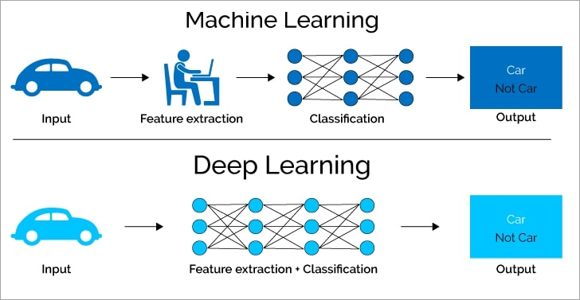
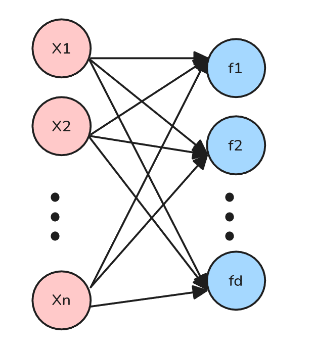
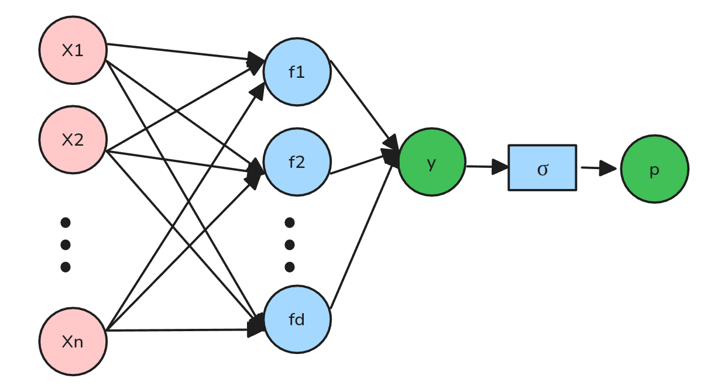
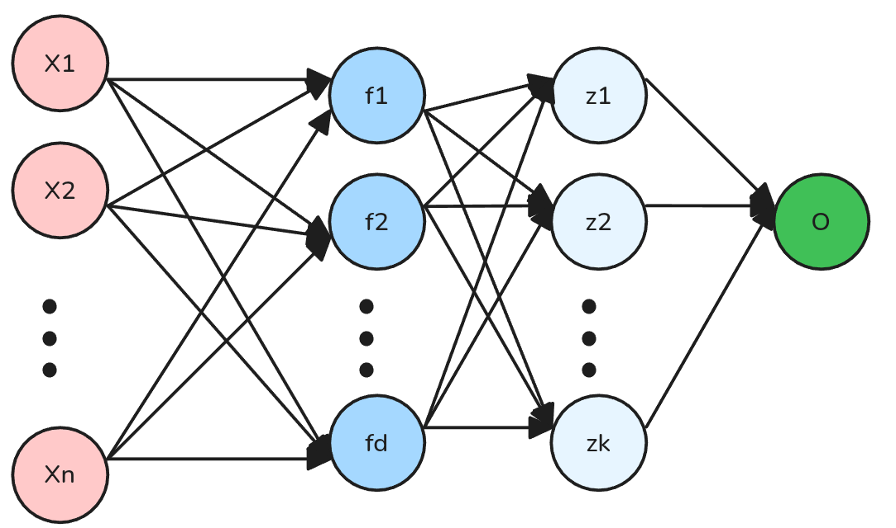
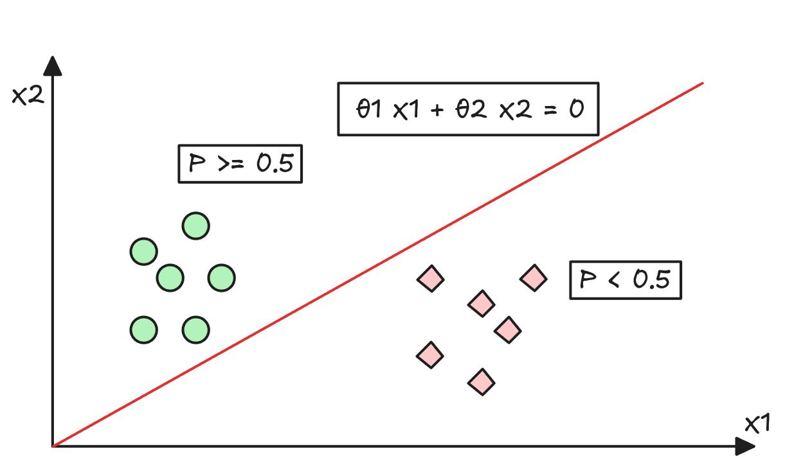
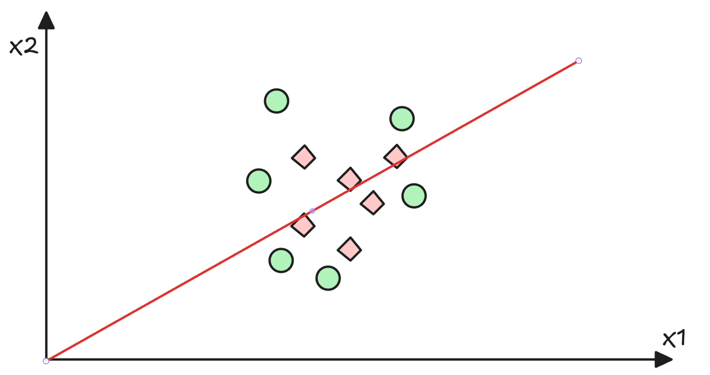
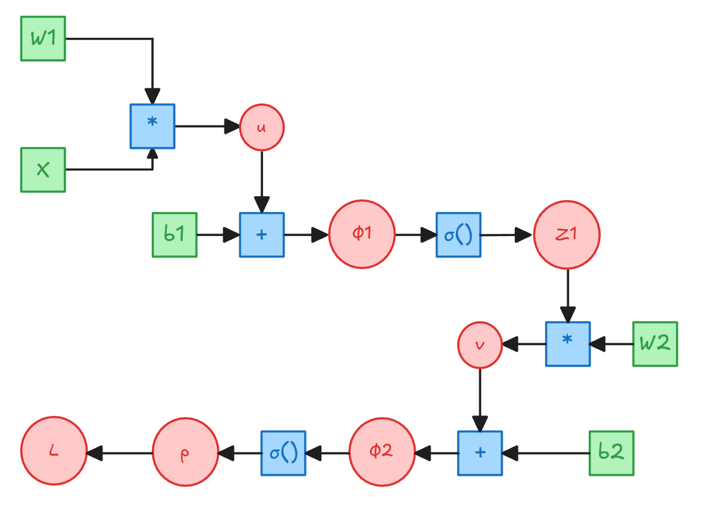

# ¿Por qué Machine Learning y Deep Learning no son lo mismo?

## Machine Learning vs Deep Learning  {.smaller}

> Es sabido que la mejor manera de mejorar el performance de un algoritmo en partícular no es con ajuste de Hiperparámetros sino crear features que sean representativas del problema.

{.lightbox fig-align="center"}

::: {.callout-caution appearance="default" icon=false}
## 🤓 ¿Cómo se mejora un modelo?
* Normalmente el `Machine Learning` busca generar features de manera manual.
* `Deep Learning` busca que el Algoritmo genere esas features de ***manera automática***.

:::

## ¿Cómo se crean features? {.smaller}

:::{style="font-size: 80%;"}
> Normalmente un approach es agregar features externas/exógenas, pero también es completamente válido crear features nuevas por medio de las existentes.
:::

::::{.columns}
:::{.column}
:::{.callout-warning appearance="default" icon=false}
## Ejemplo
Si $X_1$ es el Largo de un objeto y $X_2$ es el ancho, entonces una feature nueva podría ser $X_3 = X_1 \cdot X_2$, que es el área del objeto.
:::

:::{.callout-note appearance="default" icon=false}
###  ¿Cómo podríamos crear nuevas features pero de manera automática?

* Una opción es hacer una combinación lineal de features existentes.
  * `Esto lo podemos realizar con operaciones matriciales`.

Por ejemplo un set de nuevas features $\phi(X)$ podría ser:

$\phi(X) = X W$ donde $W \in \mathbb{R}^{n \times d}$, donde $d$ es el número de nuevas features resultantes luego del proceso de creación.

* ***Esto implica que si $X$ tiene $n$ features, entonces $\phi(X)$ tendrá $d$ features que son combinaciones de las anteriores***.
:::
:::

:::{.column style="font-size: 75%;"}
{.lightbox fig-align="center" width="50%"}

Es decir:

$$f_j^{(i)} = (\bar{x}^{(i)})^T W_{:,j} = \sum_{k=1}^n x_k^{(i)} W_{k,j}$$

Donde $j=1,...,d$ y $i=1,...,m$.
:::
::::

## Regresión Logística + Features {.smaller}

:::{.callout-note appearance="default" icon=false style="font-size: 120%;"}
## 😱 ¿Y si combinamos ambas ideas?
Perfectamente podemos crear una Regresión logística con nuestras nuevas features y combinar todo en un sólo modelo:

$$h_\theta(X) = p = \sigma(\phi(X) \theta) = \sigma(X W \theta)$$
:::

::::{.columns}
:::{.column width="60%"}
{.lightbox fig-align="center" width="80%"}
:::
:::{.column width="40%"}
:::{.callout-warning appearance="default" icon=false}
## 🤓 Nuestra Notación
* Cada nodo se le conoce como Neurona o `Activación`.
* Cada conjunto de vértices, se les conoce como `Capa` o `Capa de Parámetros`.
  * ***Ojo***: Las capas ***no son*** los conjuntos de Nodos.
:::

:::{.callout-caution appearance="default"}
## 👀 Ojo

* Existen convenciones donde cada conjunto de nodos es una capa.
  * A la primera capa de nodos se le llama Capa de `Entrada/Input Layer`.
  * A la última capa de nodos se le llama Capa de `Salida/Output Layer`.
  * A las capas intermedias se les llama `Hidden Layers`.
:::

:::
::::

## ¿Y si hacemos nuestro modelo más profundo? {.smaller}

Podemos hacer nuestro modelo más profundo, agregando más capas de features. Por ejemplo:

::::{.columns}
:::{.column}

$$h_\theta(X) = \sigma(X W_1 W_2 \theta)$$

Donde $X \in \mathbb{R}^{m \times n}$, $W_1 \in \mathbb{R}^{n \times d}$, $W_2 \in \mathbb{R}^{d \times k}$ y $\theta \in \mathbb{R}^{k \times 1}$.

:::{.callout-important appearance="default" icon=false}
## 🤔 El problema

Lamentablemente agregar capas no soluciona el problema de la linealidad. Agregar muchas capas lineales siguen siendo una transformación lineal.

$$ h_\theta(X) = \sigma(X W_1 W_2 \theta) = \sigma(X \tilde{\theta})$$

Donde $\tilde{\theta} \in \mathbb{R}^{n \times 1}$ es sólo otra matriz de parámetros.

:::
:::{.callout-caution appearance="default"}
## Atención: En este caso $\sigma(\cdot)$ tiene como único propósito acotar la salida entre 0 y 1.
:::
:::

:::{.column}

{.lightbox fig-align="center" width="90%"}

:::
::::

## El problema de una Hipótesis Lineal {.smaller}

::::{.columns}
:::{.column .fragment}
:::{.callout-tip appearance="default" icon=false}
## Esto Funciona
:::

{.lightbox fig-align="center" width="90%"}

:::
:::{.column .fragment}

:::{.callout-caution appearance="default" icon=false}
## Esto no Funciona
:::
{.lightbox fig-align="center" width="100%"}
:::
::::

:::{.callout-warning appearance="default" icon=false .fragment}
## 😞 No podemos salir del Origen
Por definición de una transformación lineal, si $X=0$ entonces $h_\theta(X)=0$. Eso lamentablemente limita las posibilidades de un modelo de poder generar una buena separación entre clases.
:::

## ¿Entonces cómo solucionamos este problema? {.smaller}

:::{.callout-note appearance="default" syle="font-size: 130%;"}
## Haremos una transformación Affine. Es decir, agregaremos un `bias` a nuestra transformación lineal.

$$\phi_{L+1}(X) = \phi_L(X) W_{L+1} + b_{L+1}^T$$

* Donde:
  * Donde $\phi(X)_{L+1}$ corresponde a las activaciones de la capa $L+1$. $L=0,...,L_{net}-1$.
    * Notar que $\phi_0(X) = X$.
    * Asimismo, $\phi_{L_{net}}(X)$ corresponde a las activaciones de la capa de salida, es decir, las predicciones del modelo.
  * $W_{L+1}$ es la matrix de `pesos/parámetros` que lleva de $n_L$ a $n_{L+1}$ dimensiones.
  * $b_{L+1}^T\in \mathbb{R}^{1 \times n_{L+1}}$ es el vector de `bias` de la capa $L$ (Esto no es un error).

:::

:::{.callout-warning appearance="default" icon=false}
## `¡Pero esto es una operación inválida!` 🙄 No. Gracias al Broadcasting, esto es equivalente a hacer $1_m \bar{b}^T$, donde $1_m$ es un vector columna de unos de tamaño $m x 1$ Esto implica que cada componente de $\bar{b} se suma igual a todas las muestras.
:::

:::{.callout-tip appearance="default" syle="font-size: 130%;"}
Vamos a utilizar funciones no lineales. **Cualquiera sirve** tal que:

$$\phi_{L+1}(X) = \sigma_{L+1}(\phi_L(X) W_{L+1} + b_{L+1}^T)$$

* Donde $\sigma_{L+1}$ es una función no lineal que aplica a cada elemento de la matriz $X W_{L+1} + b_{L+1}^T$.
* $\sigma_{L+1}$ puede ser cualquier función no lineal, pero normalmente utilizamos funciones diferenciables.
:::

## Formalmente: Una Red Neuronal Profunda {.smaller}

Vamos a definir una Red Neuronal Profunda como: 

$$h_\theta(X) = \sigma_{L+1}(\phi_L(X) W_{L+1} + b_{L+1}^T)$$

con $L=0,...,L_{net}-1$.

:::{.callout-caution appearance="default" style="font-size: 120%;"}
## Importante
* $L_{net}$ es el número de capas de parámetros ocultas de la red neuronal.
  * Notar que $\phi_0(X) = X$.
  * Existen $L_{net} + 1$ capas de activación. Una que es la capa de entrada $\phi_0(X)$ y $L_{net}$ capas ***"calculadas"***.
:::

## Entrenemos una Red Neuronal a mano {.smaller}

::::{.columns}
:::{.column width="50%"}
$W_1 \in \mathbb{R}^{n \times d1}$

$\bar{b_1}^T \in \mathbb{R}^{1 \times d1}$

$W_2 \in \mathbb{R}^{d1 \times d2}$

$\bar{b_2}^T \in \mathbb{R}^{1 \times d2}$

$$u=X W_1$$
$$\phi_1 = u + 1_m\bar{b_1}^T$$
$$Z_1 = \sigma(\phi_1)$$
$$v=Z_1 W_2$$
$$\phi_2 = v + 1_m\bar{b_2}^T$$
$$p = \sigma(\phi_2)$$
$$L = -\frac{1}{m}\left[y^T log(p) + (1-y)^T log(1-p)\right]$$

:::
:::{.column width="50%"}
{.lightbox} 

:::
::::

## Entrenemos una Red Neuronal a mano {.smaller}

Si $L=-[y^T log(p) + (1-y)^T log(1-p)]$ entonces:

::::{.columns}
:::{.column width="70%"}

$$\frac{\partial L}{\partial p} = -\frac{1}{m} \left[\frac{y^T}{p} - \frac{1 -y)^T}{(1-p)}\right] = \frac{1}{m} \left[\frac{p-y}{p(1-p)}\right]$$

$$\frac{\partial L}{\partial \phi_2} = \frac{\partial L}{\partial p} \frac{\partial p}{\partial \phi_2} = \frac{1}{m} \left[\frac{p-y}{p(1-p)}\right] p (1-p) = \frac{1}{m} \left[p-y\right]$$

$$\frac{\partial L}{\partial b_2} = \frac{\partial L}{\partial \phi_2} \frac{\partial \phi_2}{\partial b_2} = \frac{1}{m} 1_m^T \left[p-y\right]$$

$$\frac{\partial L}{\partial v} = \frac{\partial L}{\partial \phi_2} \frac{\partial \phi_2}{\partial v} = \frac{\partial L}{\partial \phi_2}$$

$$\frac{\partial L}{\partial W_2} = \frac{\partial L}{\partial v} \frac{\partial v}{\partial W_2} = \frac{\partial L}{\partial v} \cdot Z_1= \frac{1}{m} Z_1^T \left[p-y\right]$$

:::
:::{.column width="30%" .fragment}

:::{.callout-tip appearance="default" icon=false}
## Update Rule para $b_2$
$$b_2 = b_2 - \alpha \frac{1}{m} 1_m^T \left[p-y\right]$$
:::

:::{.callout-note appearance="default" icon=false}
## Update Rule para $W_2$
$$W_2 = W_2 - \alpha \frac{1}{m} Z_1^T \left[p-y\right]$$
:::

:::
::::

## Entrenemos una Red Neuronal a mano {.smaller}

$$\frac{\partial L}{\partial Z_1} =\frac{\partial L}{\partial \phi_2} \frac{\partial \phi_2}{\partial Z_1}=  \frac{\partial L}{\partial \phi_2} \cdot W_2^T = \frac{1}{m}[p-y] W_2^T $$

$$\frac{\partial L}{\partial \phi_1} = \frac{\partial L}{\partial Z_1} \frac{\partial Z_1}{\partial \phi_1}= \frac{\partial L}{\partial Z_1} \cdot \sigma'(\phi_1) = \frac{1}{m}[p-y] W_2^T \odot [Z_1  \odot (1-Z_1)]$$

$$\frac{\partial L}{\partial b_1} =\frac{\partial L}{\partial \phi_1} \frac{\partial \phi_1}{\partial \phi_1}{\partial b_1}=  \frac{\partial L}{\partial \phi_1} \cdot 1_m = \frac{1_m^T}{m} [p-y] W_2^T \odot [Z_1  \odot (1-Z_1)]$$

$$\frac{\partial L}{\partial u} = \frac{\partial L}{\partial \phi_1} \frac{\partial \phi_1}{\partial u} = \frac{\partial L}{\partial \phi_1}$$

$$\frac{\partial L}{\partial W_1} = \frac{\partial L}{\partial u} \frac{\partial u}{\partial W_1} = \frac{\partial L}{\partial u} \cdot X = \frac{1}{m} X^T [p-y] W_2^T \odot [Z_1  \odot (1-Z_1)]$$

::::{.columns}
:::{.callout-tip appearance="default" icon=false .column}
## Update Rule para $b_1$
$$b_1 = b_1 - \alpha \frac{1_m^T}{m} [p-y] W_2^T \odot [Z_1  \odot (1-Z_1)]$$
:::

:::{.callout-note appearance="default" icon=false .column}
## Update Rule para $W_1$
$$W_1 = W_1 - \alpha \frac{1}{m} X^T [p-y] W_2^T \odot [Z_1  \odot (1-Z_1)]$$
:::
::::

## Entrenamiento de una Red Neuronal {.smaller}

:::{.callout-warning appearance="default" icon=false style="font-size: 120%;"}
## ➡️ Forward Pass
* Corresponde al proceso de calcular las activaciones de cada capa para una matriz de diseño $X$.
* El forward pass permitirá calcular las variables intermedias que son necesarias para el cálculo del `Backward Pass` las cuales van variando a medida que los parámetros del modelo se actualizan.
:::

:::{.callout-tip appearance="default" icon=false style="font-size: 120%;"}
## ⬅️ Backward Pass
* Corresponde al proceso de calcular las derivadas de cada una de las variables del modelo con respecto a la función de pérdida.
* Notar que muchos calculos del `Backward Pass` dependen de los resultados del `Forward Pass`.

:::

:::{.callout-important appearance="default" icon=false style="font-size: 120%;"}
## 👀 Backpropagation
La combinación del `Forward Pass` y el `Backward Pass` se conoce como `Backpropagation` o `Retropropagación`.
:::

# 😱 Terminamos!!

::: {.footer}

Tics-579 Deep Learning por Alfonso Tobar-Arancibia está licenciado bajo <a href="http://creativecommons.org/licenses/by-nc-sa/4.0/?ref=chooser-v1" target="_blank" rel="license noopener noreferrer" style="display:inline-block;">CC BY-NC-SA 4.0

</a>

:::

# Anexo

## Broadcasting Rules {.smaller}

::::{style="font-size: 120%;"}
::: {.callout-tip appearance="default"}
### Broadcasting

Corresponde a una replica de una dimensión de manera de permitir alguna operación que requiera que ciertas dimensiones **calcen**.
:::

::: {.callout-caution appearance="default"}
### Broadcasting Rules
* Cada tensor debe tener al menos una dimensión.
* Moviéndose de derecha a izquierda por cada dimensión una vez alineadas a la derecha, las dimensiones deben:
  * Ser iguales,
  * iguales a 1,
  * o no debe existir.
:::

::: {.callout-note}
El ***Broadcasting*** evita que se tenga que almacenar información repetida, lo cual permite que las implementaciones sean más eficientes en términos de memoria. ***Siempre*** que se pueda se debe utilizar ***Broadcasting*** para simplificar un cálculo.
:::

Más info ver: [Numpy Docs](https://numpy.org/doc/stable/user/basics.broadcasting.html)
::::

