# Feed Forward Networks

## Feed Forward Networks {.smaller}

> Son redes neuronales que se caracterizan por tener una arquitectura en la que la información fluye en una sola dirección, desde las entradas hasta las salidas. En general todas las neuronas de una capa están conectadas a todas las neuronas de la siguiente capa, sin ciclos ni conexiones recurrentes.

Teorema de aproximación Universal
: > Una red neuronal feedforward con al menos una capa oculta y un número finito de neuronas, usando funciones de activación no lineales (como sigmoide, tanh o ReLU), puede aproximar cualquier función continua definida en un conjunto compacto (acotado y cerrado) de $\mathbb{R}^n$ a cualquier nivel de precisión, siempre que se utilicen suficientes neuronas y se ajusten adecuadamente los pesos y sesgos.

::: {.callout-important appearance="default"}
## Importante
* El teorema dice que es posible encontrar aproximar cualquier función.
* El teorema no dice ni cómo se hace ni los recursos necesarios para hacerlo (Número de Neuronas, capas, Hiperparámetros, etc.).
:::

::: {.callout-tip}
* Básicamente nos están diciendo que tienes la mejor herramienta que existe, pero es tu responsabilidad saber cómo utilizarla y qué recursos necesitas para lograrlo.
:::

## Feed Forward Networks (FFN) {.smaller}

::: {.callout-important}
Este tipo de Redes tiene distintos nombres que son usados de manera intercambiable:

* Capas Lineales: Probablemente por su denominación en Pytorch.
* Capas/Redes Densas: Probablemente por su denominación en Tensorflow.
* Multilayer Perceptron: O también conocido como MLP, debido a que es la generalización del Perceptrón, la primera propuesta de Redes Neuronales de Rosenblatt en 1958.
:::

::::{.columns}
:::{.column}
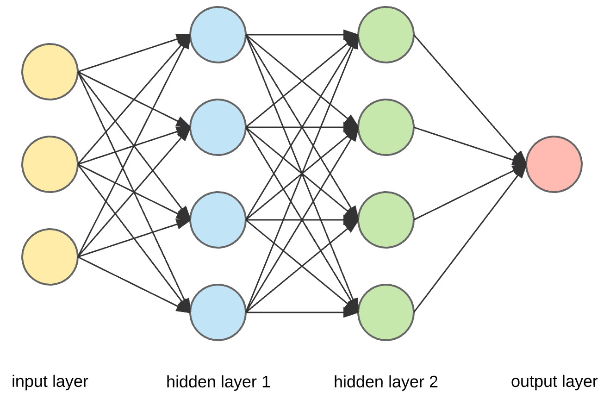{.lightbox width="60%" fig-align="center"}
:::
:::{.column}
De ahora en adelante utilizaremos las siguiente notación para referirnos a una Red Neuronal Feed Forward:

$$h_\theta(X) = \sigma_s(Z)$$

:::{.callout-warning appearance="default" icon=false}
## Logits
Definiremos $Z=\phi_L(X) W_{L+1} + b_{L+1}^T$ como Logits y corresponden a las activaciones de la última capa antes de aplicar la función de activación de salida $\sigma_s(.)$.
:::
:::

::::

## Hiperparámetros de una Red Neuronal {.smaller}

Hiperparámetros
: >  Son las configuraciones externas que no se aprenden durante el entrenamiento, sino que se definen antes de entrenar el modelo y controlan su comportamiento y rendimiento.

::: {.callout-caution style="font-size: 120%;" appearance="default" icon=false}
## 🤓 Hiperparámetros de una Red Neuronal

* ***Learning Rate*** (Karpathy Constant: 3e-4), valores entre [1e-5, 1e-1] son comunes.
* **Número de Capas** y sus respectivas dimensiones (Para Pesos/Weights y Sesgos/Biases).
* **Funciones de Activación** para cada capa.
* **Función de Pérdida** (Loss Function) a utilizar.
* **Optimizador** a utilizar.
* **Punto de Partida** de los Parámetros (Inicialización de Pesos y Sesgos).
* ¿Cuánto tiempo debo entrenar mi modelo? ***¿Cómo sabemos si es que convergió o no?***
:::

## Output de una Red Neuronal {.smaller}

> En el aprendizaje supervisado se abordan principalmente dos tipos de problemas: clasificación y regresión. Según el tipo de problema, la hipótesis debe adoptar una forma distinta en la capa de salida.

:::{.callout-important appearance="default" style="font-size: 120%;" icon=false}
## ⚠️ Dimensión de Salida
Está definida por el número de valores a predecir para cada observación. Denominaremos $k$ como la dimensión de salida.

Para una red de dos capas:

$$\phi_0(X) = X$$
$$\phi_1(X) = \sigma_1(W_1 \cdot \phi_0(X) + \bar{b_1}^T)$$
$$\phi_2(X) = \sigma_2(W_2 \cdot \phi_1(X) + \bar{b_2}^T)$$

Donde $W_1 \in \mathbb{R}^{n \times d_1}$ y $W_2 \in \mathbb{R}^{d_1 \times k}$ y $b_1 \in \mathbb{R}^{d_1}$ y $b_2 \in \mathbb{R}^{k}$.
:::

:::{.callout-note appearance="default" style="font-size: 120%;" icon=false}
## ✅ Activación de la Salida
Según el tipo de problema, la capa de salida puede necesitar una función de activación particular que ajuste los resultados al formato correcto. En este sentido, $\sigma_2$ estará determinada por la naturaleza del problema a resolver.
:::

## Consejos para el Output de una Red {.smaller}
::: {.columns}
::: {.column}
:::{.callout-note appearance="default" icon=false}
## Clasificación Binaria
El approach más común utiliza $k=1$ con una ***Sigmoide*** para calcular la probabilidad de la clase 1. Otros approach utilizan $k=2$ para calcular la probabilidad de ambas clases (Activando con ***Softmax***).
:::

:::{.callout-warning appearance="default" icon=false}
## Clasificación Multiclase
Utiliza $k=C$ donde C es el número de clases a clasificar. Se usa una función ***Softmax*** para transformar el output en una distribución de probabilidades.
:::

:::{.callout-important appearance="default" icon=false}
## Clasificación Multilabel
Se requiere un $k=C$ donde C es el número de clases a clasificar. Se usa una función ***Sigmoide*** para transformar cada clase en probabilidades.
:::
:::
::: {.column}

:::{.callout-caution appearance="default" icon=false}
## Regresión Simple
Se requiere un $k=1$. Típicamente no requiere de funciones adicionales aunque a veces se agregan funciones para acotar la salida.
:::

:::{.callout-tip appearance="default" icon=false}
## Regresión Multiple
Se requiere un $k=V$ con V el número de valores a predecir. Se deben tener las mismas consideraciones para acotar la salida.
:::

:::
::: 

::: {.callout .fragment appearance="default" icon=false}
## 👀 Muy Importante
En la mayoría de las implementaciones en Código la activación de la salida va embebida en la Loss Function. Por lo tanto, no es necesario aplicar una función de activación explícita en la capa de salida. Aunque sí deben aplicarse al momento de la ***Predicción del modelo***.
:::

## Funciones de Activación {.smaller}

Activation Functions
: Corresponden a las funciones que agregarán características no lineales a cada activación, impidiendo la composición de transformaciones Affine.

::: {.callout-tip icon=false appearance="default"}
## 🤓 Convención para Código
En Pytorch, nunca aplicaremos una función de activación a la capa de salida.
:::

::: {.callout-warning appearance="default"}
## Cuidado
Otros frameworks como Tensorflow, Keras, etc. utilizan una convención distinta y aplican funciones de activación a la capa de salida.
:::

::: {.callout-note appearance="default" icon=false}
## ¿Puedo aplicar distintas Funciones de Activación a cada Neurona?

Puedo, pero no se hace. Complicaría muchísimo la implementación.
:::

[Activation Functions in Pytorch](https://pytorch.org/docs/stable/nn.html#non-linear-activations-weighted-sum-nonlinearity).

## Funciones de Activación {.smaller}

### Sigmoide

::::{.columns}
:::{.column width="60%"}
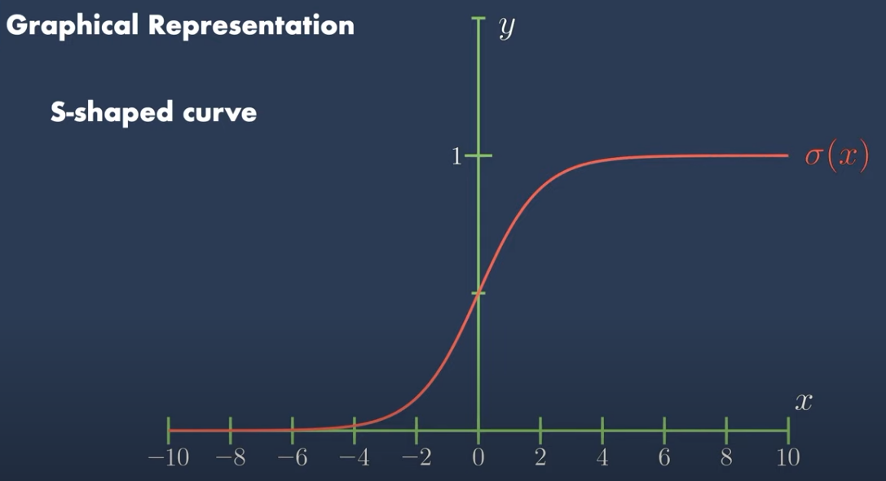{.lightbox fig-align="center" width="80%"}
:::

:::{.column width="40%"}

:::{.callout-tip appearance="default" icon=false style="font-size: 120%;"}
## Definición

$$\sigma(z) = \frac{1}{1 + e^{-z}}$$
:::
:::{.callout-warning appearance="default" icon=false}
## Propiedades

* Acota la salida entre 0 y 1.
* Su derivada es $\sigma'(z) = \sigma(z)(1 - \sigma(z))$.
* Su gradiente es general es muy pequeño, lo que lleva a problemas de ***Vanishing Gradient***.
* Su principal uso es en la capa de salida para problemas de clasificación binaria y Clasificación Multilabel.
:::
:::
::::

## Funciones de Activación {.smaller}

### Softmax

::::{.columns}
:::{.column width="60%"}
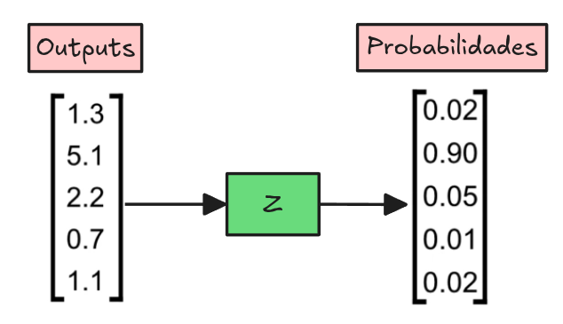{.lightbox fig-align="center" width="80%"}
:::

:::{.column width="40%"}

:::{.callout-tip appearance="default" icon=false style="font-size: 120%;"}
## Definición

$$S_i(z) = \frac{e^{z_i}}{\sum_{j=1}^k e^{z_j}}$$
:::
:::{.callout-warning appearance="" icon=false}
## Propiedades

* Transofrma un vector en una distribución de probabilidad.
* Su principal uso es en la capa de salida para problemas de clasificación multiclase. Es por lejos la función de activación más utilizada en la salida, pero en casos más avanzados también en Mecanismos de Atención.
:::
:::
::::

## Funciones de Activación {.smaller}

### Tanh

::::{.columns}
:::{.column width="60%"}
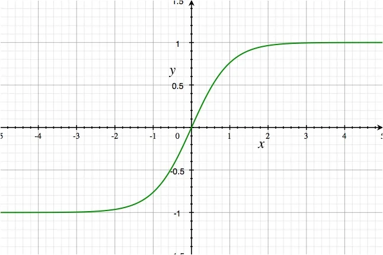{.lightbox fig-align="center" width="80%"}
:::

:::{.column width="40%"}

:::{.callout-tip appearance="default" icon=false style="font-size: 120%;"}
## Definición

$$Tanh(z) = \frac{e^z - e^{-z}}{e^z + e^{-z}}$$
:::
:::{.callout-warning appearance="" icon=false}
## Propiedades

* Acota su salida entre -1 y 1.
* Su derivada es $Tanh'(z) = 1 - Tanh^2(z)$.
* Su gradiente normalmente es más grande que el de la Sigmoide, pero aún así puede llevar a problemas de ***Vanishing Gradient***.
* A pesar de estar un poco en desuso, tiene un rol protagónico en las `Redes Recurrentes` (RNNs).
:::
:::
::::

## Funciones de Activación {.smaller}

### ReLU (Rectified Linear Unit)

::::{.columns}
:::{.column width="60%"}
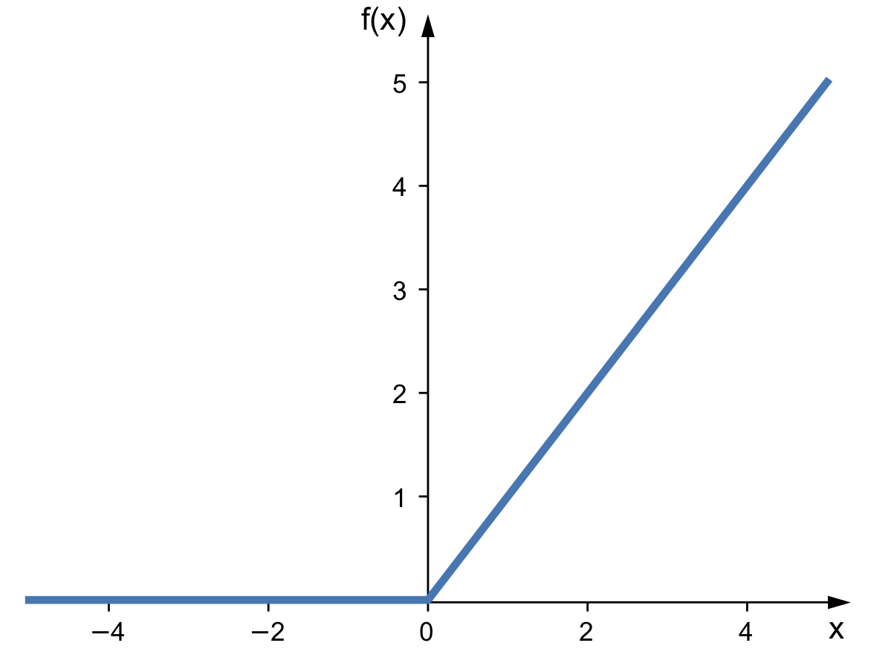{.lightbox fig-align="center" width="80%"}
:::

:::{.column width="40%"}

:::{.callout-tip appearance="default" icon=false style="font-size: 120%;"}
## Definición

$$ReLU(z) = max(0, z)$$
:::

:::{.callout-warning appearance="" icon=false}
## Propiedades

* Acota su salida entre 0 e $\infty$.
* Su derivada es $ReLU'(z) = \begin{cases}
1,  & \text{if $z \ge$ 0} \\
0 & \text{if $z < 0$}
\end{cases}$
* Es la función de activación más utilizada en la actualidad, principalmente en las capas ocultas de las Redes Neuronales.
* Se hizo extremadamente popular por su simplicidad y efectividad en `Redes Convolucionales` (CNNs).
:::
:::
::::

## Funciones de Activación Modernas {.smaller}

::: {.columns}
::: {.column}
### Leaky ReLU
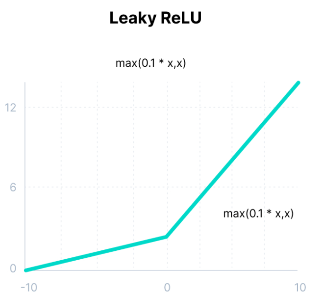{.lightbox width="60%" fig-align="center"}

$$g(z) = max(0.1z, z)$$
:::
::: {.column}
### Parametrized ReLU (PReLU)
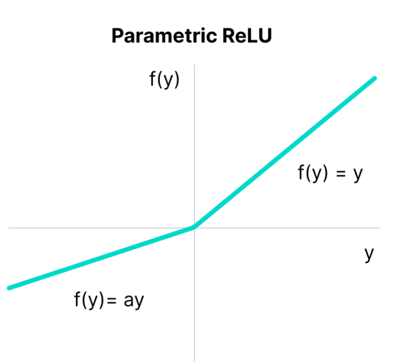{.lightbox width="60%" fig-align="center"}

$$g(z) = max(az, z)$$
:::
::: 

## Funciones de Activación {.smaller}

::: {.columns}
::: {.column}
### ELU
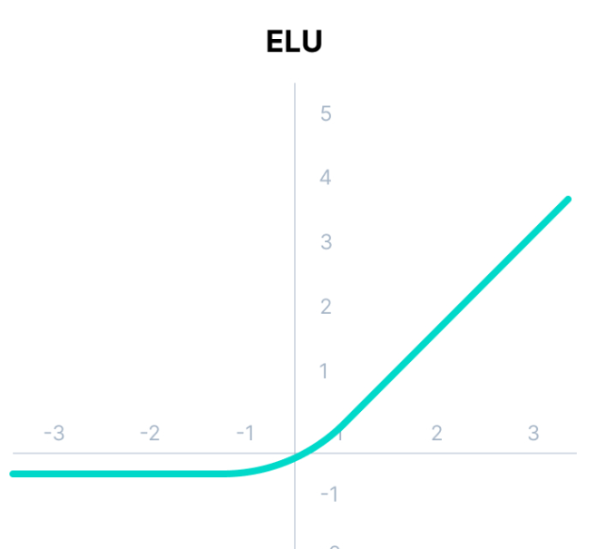{.lightbox width="60%" fig-align="center"}
$g(z) =
\begin{cases}
z,  & \text{if $z \ge$ 0} \\[2ex]
\alpha(e^{z}-1), & \text{if $z < 0$}
\end{cases}$
:::
::: {.column}
### GELU
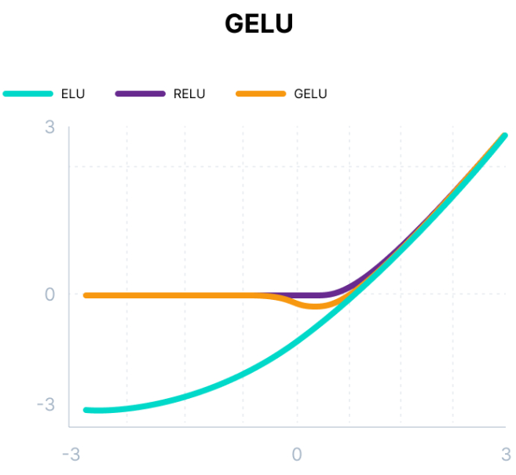{.lightbox width="60%" fig-align="center"}
$$\begin{align} g(z) &= z \cdot \Phi(z) \\
g(z)&= 0.5 \cdot z \cdot \left(1 + Tanh\left(\sqrt{2/\pi}\right) \cdot \left(z + 0.044715 \cdot z^3\right)\right)\end{align}$$
:::
::: 

## Funciones de Activación {.smaller}
::: {.columns}
::: {.column}
### SELU
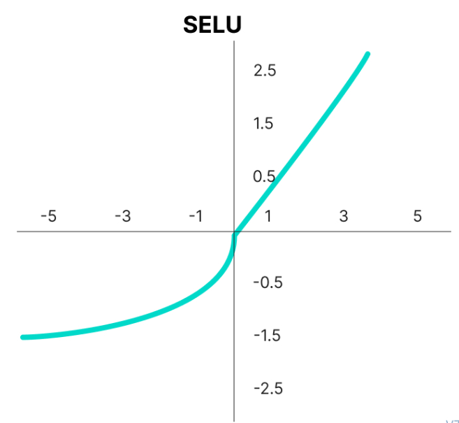{.lightbox width="60%" fig-align="center"}
$$ g(z) = scale \cdot (max(0,z) + min(0,\alpha(e^z - 1)))$$

con $\alpha=1.6732632423543772848170429916717$ y $scale = 1.0507009873554804934193349852946$
:::
::: {.column}
### Swish
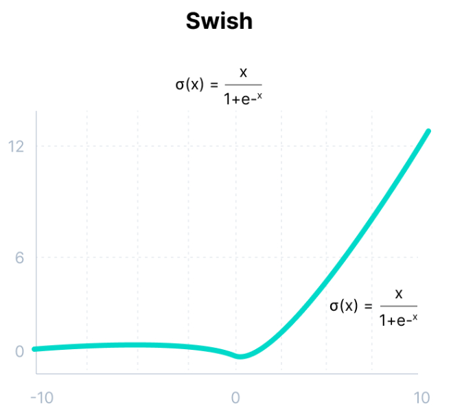{.lightbox width="60%" fig-align="center"}
$$g(z) = z \cdot sigmoid(z)$$

:::
::: 

## Loss Functions: Clasificación {.smaller}

> Son las encargadas de medir el error entre la predicción del modelo y el valor real. En general, se busca minimizar la Loss Function durante el entrenamiento del modelo.

:::{.callout-note appearance="default" icon=false style="font-size: 120%;"}
## Clasificación Binaria: Binary Cross Entropy

$$BCE(Z) = - \frac{1}{m}\left[y^T log(\sigma(Z)) + (1-y)^T log(1-\sigma(Z))\right]$$

Donde $Z$ corresponden a los Logits del Modelo.
:::

::: {.callout-important}
En Pytorch esta función se llama `BCEWithLogitsLoss`.
:::

:::{.callout-warning appearance="default" icon=false style="font-size: 120%;"}
## 🤓 Logits
Se refiere a las activaciones finales del modelo antes de aplicar la función de activación.
:::

::: {.callout-important appearance="default"}
## 👊 Clasificación Multilabel: BCEWithLogitsLoss
En Pytorch se suele utilizar `BCEWithLogitsLoss` ya que combina una sigmoide a cada activación de la salida.
:::

## Loss Functions: Clasificación {.smaller}

:::{.callout-note appearance="default" icon=false style="font-size: 120%;"}
## Clasificación Multiclase: CrossEntropy
$$CE(Z)= \frac{1}{m}Tr(Y^T \hat{Y})$$

Donde $Tr(.)$ es la traza de una matriz e $Y \in \{0,1\}^{m \times k}$ es la codificación One-Hot de las etiquetas y $\hat{Y} = Softmax(Z)$, donde $Z$ son los Logits del modelo.
:::

:::{.callout-tip appearance="default" icon=false style="font-size: 120%;"}
## 🤓 Traza ($Tr(.)$)
Corresponde a la suma de los elementos de la diagonal principal de una matriz.
:::

:::{.callout-warning appearance="default" icon=false style="font-size: 120%;"}
## Derivada
$$\frac{\partial CE(X)}{\partial Z} = \frac{1}{m}\left(Softmax(Z) - Y\right)$$
:::

::: {.callout-tip}
En Pytorch se suele utilizar `CrossEntropyLoss` ya que combina aplica una función Softmax a la capa de salida además de ser una clase numericamente más estable.
:::

## Loss Functions: Regresión {.smaller}

:::{.callout-note appearance="default" icon=false style="font-size: 120%;"}
## Regresión: Mean Squared Error (MSELoss)
$$MSE(Z) = \frac{1}{m}||Z - \bar{y}||^2$$

Donde $||.||$ corresponde a la norma Euclideana e $\bar{y} \in \mathbb{R}^{m \times 1}$.
:::

:::{.callout-warning appearance="default" icon=false style="font-size: 120%;"}
## Derivada
$$\frac{\partial MSE(Z)}{\partial Z} = \frac{2}{m}(Z - \bar{y})$$
:::

## Loss Functions: Regresión {.smaller}

:::{.callout-note appearance="default" icon=false style="font-size: 120%;"}
## Regresión: Mean Absolute Error (L1Loss)

$$L1Loss(Z) = \frac{1}{m}|Z - \bar{y}|$$

Donde $||.||$ corresponde a la norma Euclideana y $\bar{y} \in \mathbb{R}^{m \times 1}$.
:::

:::{.callout-warning appearance="default" icon=false style="font-size: 120%;"}
## Derivada
$$\frac{\partial L1Loss(Z)}{\partial Z} = \frac{1}{m}sign(Z-\bar{y})$$

$$\operatorname{sign}(z) =
\begin{cases}
+1 & \text{si  z > 0},\\[2mm]
0 & \text{si z = 0},\\[1mm]
-1 & \text{si z < 0}
\end{cases}$$
:::

## Optimizers: Gradient Descent {.smaller}

:::{style="font-size: 80%;"}
> Gradient Descent corresponde al algoritmo de Optimización más popular, pero no necesariamente el más eficiente. Distintas variantes han ido apareciendo para ir mejorando eventuales deficiencias de la proposición inicial.
:::

:::{.callout-warning appearance="default" icon=false}
## Epochs
Corresponden a la cantidad de iteraciones que se realizan a la Update Rule para que el modelo se optimize.
:::

:::{.callout-note appearance="default" icon=false style="font-size: 120%;"}
#### Standard Gradient Descent

$$\theta := \theta - \frac{\alpha}{m}\nabla_\theta L$$
:::

::: {.callout-caution appearance="default"} 
### Importante
* En Deep Learning, los conjuntos de datos suelen ser tan grandes que calcular el gradiente sobre todos ellos es inviable por memoria y tiempo de cómputo.
* Adicionalmente no basta con calcular el gradiente una vez, sino que se debe hacer varias veces según el número de Epochs definido.
* Practicar Standard Gradient Descent en la práctica es muy poco común, ya que no es eficiente.
:::

## Minibatch Gradient Descent {.smaller}

::: {.callout-important}

Los `minibatches` permiten estimar el gradiente con un subconjunto de datos, manteniendo la dirección correcta para actualizar los parámetros de manera más eficiente. Se realiza en un subconjunto de $B$ datos donde $B << m$.
:::

$$\theta := \theta - \frac{\alpha}{B}\nabla_\theta L$$

:::{.callout-warning appearance="default" icon=false}
## 👀 Importante
* $X \in \mathbb{R}^{B \times n}$ e $y \in \mathbb{R}^{B \times 1}$ son versiones reducidas de los datos totales. Se deben hacer suficientes `minibatches` para utilizar todos los datos.
* Cada actualización de parámetros ahora se le denomina `step`.
* Cuando todos losd `minibatches` han sido utilizados, se dice que se ha completado una `epoch`.
* Es común utilizar un `minibatch` de tamaño 32, 64 o 128.
* A veces se deshecha el último `minibatch` si no tiene el tamaño completo para evitar problemas de estabilidad de graientes.
:::

:::{.callout-tip appearance="default" icon=false}
## Pros
* Permite optimizar utilizando menos recursos computacionales.
* Al actualizar los parámetros de manera más frecuente, se puede converger más rápido.
:::

:::{.callout-important appearance="default" icon=false}
## Contras
* Si $B$ es muy pequeño, el gradiente puede ser muy ruidoso y no converger.
* El entrenamiento toma más tiempo que el Standard Gradient Descent.
:::

## SGD with Momentum {.smaller}

::::{.columns}
:::{.column style="font-size: 90%;"}
#### Update Rule

$$\theta_{t+1} = \theta_t - \alpha v_{t + 1}$$
$$v_{t+1} = \beta v_{t} + (1-\beta) \nabla_\theta L(\theta_{t+1})$$

donde $0<\beta<1$, pero normalmente $\beta=0.9$.
:::
:::{.column}
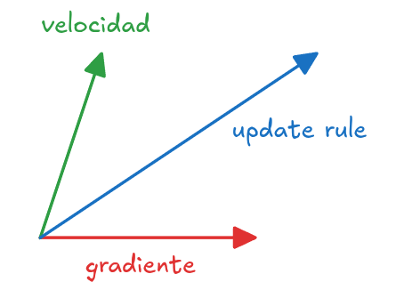{.lightbox width="45%" fig-align="center"}
:::
::::

::: {.callout-note appearance="default" icon=false}
## ☝️ Intuición
* Este cálculo se denomina un Exponential Moving Average de los Gradientes. Y se puede interpretar como una especie de velocidad del gradiente. Su objetivo es ponderar con un cierto porcentaje el gradiente actual y el gradiente anterior.
* $v_{0} = 0$
:::

$$\begin{align} v_{t+1}&=(1-\beta)\nabla_\theta L(\theta_{t}) + \beta v_t \\
v_{t+1}&=(1-\beta)\nabla_\theta L(\theta_{t}) + \beta \left[(1-\beta) \nabla_\theta L(\theta_{t-1}) + \beta v_{t-1}\right] \\
v_{t+1}&=(1-\beta)\nabla_\theta L(\theta_{t}) + \beta (1-\beta) \nabla_\theta L(\theta_{t-1}) + \beta^2 (1-\beta) \nabla_\theta L(\theta_{t-2})... \\
\end{align}$$

## SGD with Nesterov Momentum {.smaller}

::::{.columns}
:::{.column}
$$\theta_{t+1} = \theta_t - \alpha u_{t + 1}$$
$$v_{t + 1} = \beta v_t + (1-\beta) \nabla_\theta f(\theta_{t+1} + \beta v_t)$$

donde $0<\beta<1$, pero normalmente $\beta=0.9$.
:::
:::{.column}
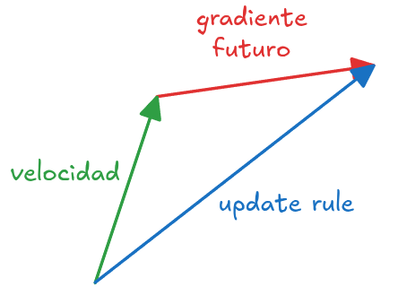{.lightbox fig-align="center" width="50%"}
:::
::::
::: {.callout-note appearance="default" icon=false}

## ☝️ Intuición
El método de Nesterov "mira hacia adelante" en la dirección del momentum antes de calcular el gradiente, lo que le da una corrección más precisa y evita en parte el sobrepaso de mínimos. En este caso $\theta_{t+1} + \beta v_t$ es el punto "futuro" para calcular el gradiente.
:::

## Efecto del Momentum en el Update Rule {.smaller}

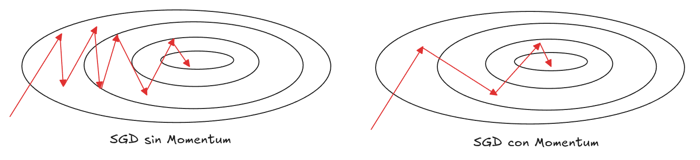{.lightbox fig-align="center"}

:::{.callout-note appearance="default" icon=false}
## ☝️ Intuición

* El SGD tiende a ser más oscilante.
* El SGD con Momentum tiende a ser más suave y rápido debido a la inercia recibida por el término de momentum.
:::

## Métodos Adaptativos: Adagrad {.smaller}

:::{.callout-note appearance="default" icon=false}
## ☝️ Intuición
¿Qué tal, si el learning rate se va adaptando en el tiempo y deja de ser estática?
:::

$$r_{t+1} = r_t + \nabla_\theta f(\theta_t)^2$$
$$\theta_{t+1} = \theta_t - \frac{\alpha}{\sqrt{r_{t+1}}}\nabla_\theta f(\theta_t)$$

:::{.callout-warning appearance="default" icon=false}
## Efecto
* Parámetros con gradientes grandes $\rightarrow$ tasa de aprendizaje disminuye más rápido.
* Parámetros con gradientes pequeños $\rightarrow$ tasa de aprendizaje se mantiene más alta.
:::

:::{.callout-tip appearance="default" icon=false}
## Pros
* Util cuando hay parámetros que se actualizan con distinta freciencia.
* Acelera la convergencia en direcciones poco exploradas.
:::

:::{.callout-important appearance="default" icon=false}
## Contras
* Como el denominador acumula gradientes al cuadrado, la tasa de aprendizaje puede llegar a volverse muy pequeña $\rightarrow$ el entrenamiento se ***"frena"*** antes de llegar al óptimo.
:::

## Métodos Adaptativos: RMSProp {.smaller}

::: {.callout-note appearance="default" icon=false}
## ☝️ Intuición
* Normalizar por el Exponential Moving Average de los Gradientes al cuadrado para controlar el efecto de reducción del learning rate.
:::

$$s_{t+1} = \beta r_t + (1-\beta) \nabla_\theta f(\theta_t)^2$$
$$\theta_{t+1} = \theta_t - \frac{\alpha}{\sqrt{s_{t+1}}}\nabla_\theta f(\theta_t)$$

:::{.callout-tip appearance="default" icon=false}
## Pros
* Normalización adaptativa: cada parámetro tiene su propia tasa de aprendizaje ajustada dinámicamente.
* A diferencia de Adagrad, el denominador no crece indefinidamente porque el promedio exponencial “olvida” gradientes antiguos. Esto permite seguir aprendiendo incluso después de muchos pasos.
:::

:::{.callout-important appearance="default" icon=false}
## Contras
* Depende mucho de la elección de su hiperparámetro $\beta$
:::

## Métodos Adaptativos: Adam {.smaller}

::: {.callout-note appearance="default" icon=false}
## ☝️ Intuición
Se mantiene el Exponential Moving average para: Los gradientes (como utilizando momentum), los gradientes al cuadrado (como RMSprop).

:::

::: {.columns}
::: {.column}
$$v_{t+1} = \beta_1 v_t + (1-\beta_1) \nabla_\theta f(\theta_t)$$
$$s_{t+1} = \beta_2 s_t + (1-\beta_2) \nabla_\theta f(\theta_t)^2$$
$$\theta_{t+1} = \theta_t - \frac{\alpha}{\sqrt{s'_{t+1}}} v'_{t+1}$$
:::
::: {.column}
##### Correcciones Iniciales

$$v'_{t+1} = \frac{v_{t+1}}{1-\beta_1^{t+1}}$$
$$s'_{t+1} = \frac{v_{t+1}}{1-\beta_2^{t+1}}$$
:::
::: 

:::{.callout-tip appearance="default" icon=false}
## Pros
* Combina momentum + RMSprop + corrección $\rightarrow$ rápido, estable.
* Es por lejos el optimizador más usado.
:::

:::{.callout-important appearance="default" icon=false}
## Contras
* Sensible a la elección de sus hiperparámetros $\beta_1$ y $\beta_2$. Pytorch utiliza 0.9 y 0.999 como valores de $\beta_1$ y $\beta_2$ respectivamente.
:::

# 👊 Eso es todo amigos

::: {.footer}

Tics-579 Deep Learning por Alfonso Tobar-Arancibia está licenciado bajo <a href="http://creativecommons.org/licenses/by-nc-sa/4.0/?ref=chooser-v1" target="_blank" rel="license noopener noreferrer" style="display:inline-block;">CC BY-NC-SA 4.0

</a>

:::
