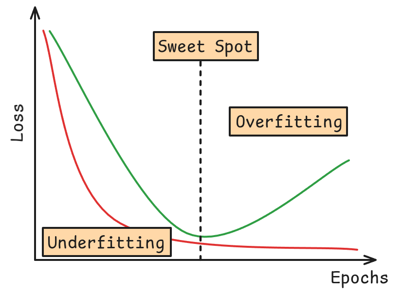
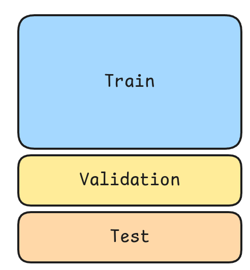
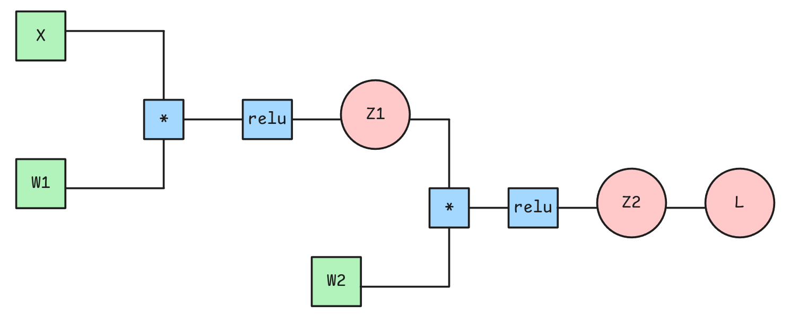
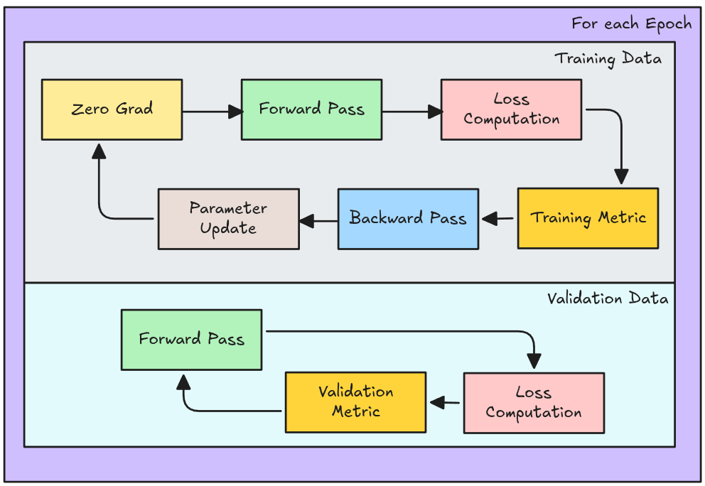
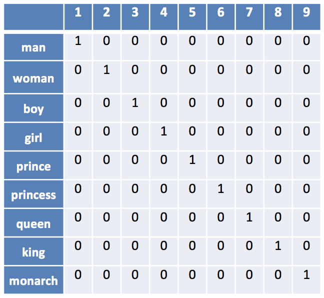
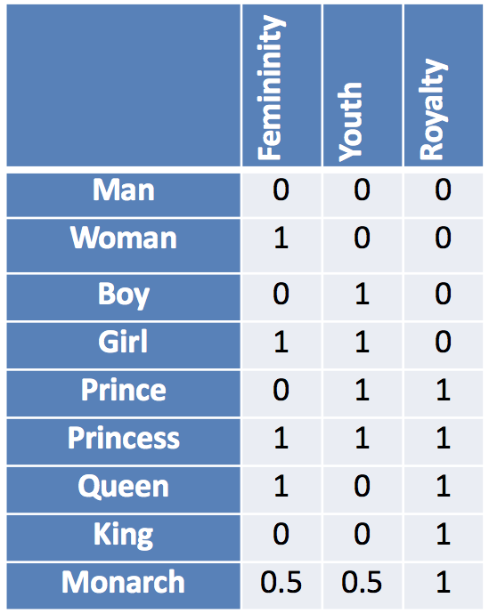
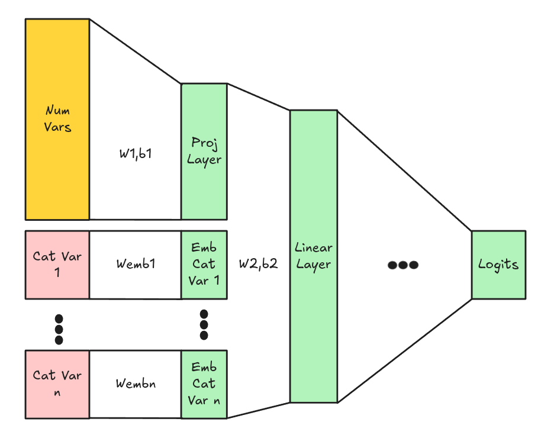
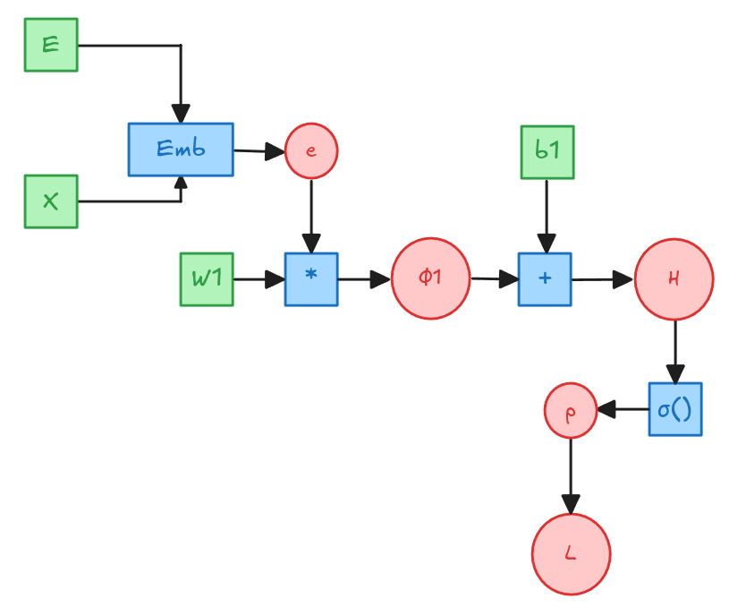
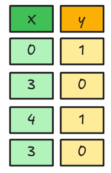
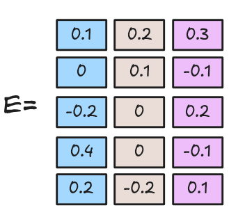

## Entrenamiento de la Red {.smaller}


> A diferencia de un Modelo de Machine Learning, las Redes Neuronales se entrenan de ***manera progresiva*** (se espera una mejora en cada Epoch). Si nuestra Arquitectura es apropiada nosotros deberíamos esperar que el `Loss` de nuestra ***red siempre disminuya***. ¿Por qué?

:::{.callout-tip .fragment icon=false appearance="default"}
## 💡 Dado que el entrenamiento es progresivo, el modelo puede retomar su entrenamiento desde un set de pesos dados.
:::


::: {.columns}

::: {.column}

{.lightbox fig-align="center"}


:::

::: {.column}
::: {.callout-warning .fragment icon=false appearance="default"}
## **¿Siempre buscamos la Red que tenga el mejor Loss de Entrenamiento?** ***¿Cuál es la diferencia entre el `Loss` y el `Rendimento del Modelo`?***
:::


::: {.callout-important .fragment icon=false appearance="default"}
## Al igual que en los modelos de Machine Learning debemos evitar a toda costa el Overfitting. ¿Qué es el overfitting?
:::

:::

:::


## Entrenamiento de la Red {.smaller}

Bias-Variance Tradeoff (Dilema Sesgo-Varianza)
: > Probablemente el concepto más importante para determinar si un modelo tiene potencial o no. Corresponden a dos tipos de errores que pueden sufrir los modelos de ML. 

::: {.columns .fragment}
::: {.column .callout-note appearance="default" icon=false}
## Bias
Corresponde al sesgo, y tiene que ver con la diferencia entre el valor real y el valor predicho. Bajo sesgo implica una mejor predicción.
:::
::: {.column .callout-caution appearance="default" icon=false}
## Variance
Corresponde a la varianza y tiene que ver con la dispersión de los valores predichos. Baja Varianza implica un modelo más estable y menos flexible.
:::

::: {.callout-important .fragment appearance="default" icon=false}
## En general hay que buscar el equilibrio entre ambos tipos de errores:

* Alto Sesgo y baja Varianza: **Underfitting**. 
* Bajo Sesgo y Alta Varianza: **Overfitting**. 

:::
:::

## Model Validation {.smaller}

Validación Cruzada
: > Se refiere al proceso de entrenar un modelo en una cierta porción de los datos, pero validar sus rendimiento y capacidad de ***generalización*** en un set de datos ***no vistos*** por el modelo al momento de entrenar. 

::::{style="font-size: 120%;"}
::: {.callout-warning icon=false appearance="default" }
## ***¿Qué es la Generalización?***
:::

::: {.callout-note icon=false appearance="default" }
## Los dos métodos más populares que se usan en Machine Learning son **Holdout** y **K-Fold.** Más métodos se pueden encontrar en los [docs de Scikit-Learn](https://scikit-learn.org/stable/modules/cross_validation.html). 
:::

::: {.callout-important icon=false appearance="default" }
## Debido a los volúmenes de datos utilizados, el esquema de validación más utilizado es el **Holdout**.
:::
::::

## Model Validation: Holdout {.smaller}

::: {.columns}
::: {.column}

{.lightbox fig-align="center"}
:::
::: {.column}

::: {.callout-note appearance="default" icon="false"}
## **Train**
Corresponde a la porción de utilizado para que el modelo aprenda.
:::
::: {.callout-important appearance="default" icon="false"}
## **Validation**
Corresponde a la porción de datos no vistos por el modelo durante el entrenamiento. Se utiliza para medir el nivel de generalización del modelo.
:::
::: {.callout-caution appearance="default" icon="false"}
## **Test**
Se utiliza para evaluar reportando una métrica de diseño del Modelo.
:::

::: {.callout-caution}
A diferencia de un modelo de Machine Learning el proceso de validación del modelo se realiza en conjunto con el entrenamiento. Es decir, se entrena y valida el modelo Epoch a Epoch.
:::
:::
::: 

## Pytorch: Model Evaluation {.smaller}

:::{style="font-size: 75%;"}
> Nos referimos a la evaluación del modelo como la medición de la performance esperada por nuestro modelo. La Evaluación del Modelo se realiza en torno a una métrica definida a priori por el modelador. La métrica a utilizar está íntimamente ligada al problema a resolver.
:::

::: {.columns}
::: {.column}

::: {.callout-note appearance="default" icon="false"}

#### Clasificación

* $Accuracy = \frac{1}{m} \sum_{i = 1}^m 1\{y_i = \hat{y_i}\}$
* $Precision = \frac{TP}{TP + FP}$
* $Recall = \frac{TP}{TP + FN}$
* $F1-Score = 2 \cdot \frac{Precision \cdot Recall}{Precision + Recall}$
:::
:::


::: {.column}

::: {.callout-important appearance="default" icon="false"}
#### Regresión
* $RMSE = \frac{1}{m} \sum_{i=1}^m (y_i-\hat{y_i})^2$
* $MAE = \frac{1}{m} \sum_{i=1}^m |y_i - \hat{y_i}|$
* $MAPE = 100 \cdot \frac{1}{m} \sum_{i=1}^m \frac{|y_i-\hat{y_i}|}{max(\epsilon,y_i)}$
* $SMAPE = \frac{2}{m} \sum_{i=1}^2 \frac{|y_i - \hat{y_i}  |}{max(|y_i + \hat{y_i}|,\epsilon)}$
:::
:::
::: 


::: {.callout-warning icon=false appearance="default"}
## 🤓
Las métricas presentadas son las básicas para clasificación y regresión. Existen otras más específicas según el campo:

* IoU en segmentación semántica, MAP@k en recomendación, BLEU o ROUGE en NLP, etc.
* Una lista extensa puede consultarse en [Torchmetrics](https://lightning.ai/docs/torchmetrics/stable/all-metrics.html)
.
:::

::: {.callout-warning icon=false appearance="default"}
## 🤔 Medir la performance de un modelo de Deep Learning se complica al usar Mini-Batch. ¿Por qué?
:::


# ¿Qué es Pytorch?

## Pytorch {.smaller}
> Es una librería de manipulación de Tensores especializada en Deep Learning. Provee principalmente, manipulación de tensores (igual que Numpy, pero en GPU), además de Autograd (calcula derivadas de manera automática).

Para poder comenzar a utilizarlo se requieren normalmente 3 imports:

```{.python code-line-numbers="|1|2|3|"}
import torch
import torch.nn as nn
import torch.nn.functional as F
```

::: {.callout-important appearance="default" icon=false}
## 👀
* `torch` es donde se encuentran la mayoría de funciones básicas para manipular tensores.
* `torch.nn` es donde se encuentran los módulos necesarios para poder crear redes neuronales (neural networks). Cada módulo es una clase en Python.
* `torch.nn.functional` es donde se encontrarán `utility functions` además de versiones funcionales de elementos de `torch.nn`. 
:::

::: {.callout-tip appearance="default"}
## 👀 Una versión funcional es capaz de replicar la operación de un módulo pero no tiene la capacidad de almacenar los parámetros aprendidos.
:::

## Pytorch: Basics {.smaller}

Es posible realizar todas las operaciones básicas de manipulación de tensores con Pytorch. Algunos ejemplos: 

::: {.columns}

::: {.column}

### Vectores
```{.python}
a = torch.tensor([1, 2, 3])
b = torch.tensor([4, 5, 6])
```

```{.python}
## Producto Interno
a.dot(b)
a.reshape(1, -1) @ b.reshape(-1, 1)
```
```{.python}
## Producto Externo
torch.outer(a, b)
a.reshape(-1, 1) @ b.reshape(1, -1)
```
```{.python}
## Producto Hadamard
a * b
```

:::

::: {.column}

### Matrices
```{.python}
A = torch.randn(4, 3)
B = torch.randn(3, 2)
C = torch.randn(4, 3)
```

```{.python}
## Producto Matricial
A @ B
```

```{.python}
## Suma
A + C
```

```{.python}
## Transpuesta
A.T
```
:::

:::

### Tensores

```{.python}
## Tensores
AT = torch.randint(1, 10, (2, 3, 4))
BT = torch.randint(1, 10, (2, 4, 2))

```

```{.python}
## Multiplicación Tensorial
AT @ BT
AT.bmm(BT)
```

```{.python}
AT.transpose(0,2).shape
AT.permute(1,2,0).shape
```

## Pytorch: Autograd {.smaller}

Adicionalmente, PyTorch cuenta con un motor de diferenciación automática llamado `Autograd`, que permite calcular derivadas automáticamente mediante un grafo computacional utilizando operaciones con tensores.


::: {.callout-important style="font-size: 90%;" icon=false appearance="default"} 
## 👀 Ojo: Las derivadas que nosotros ocupamos sólo tienen sentido porque son derivadas escalares (como por ejemplo el Loss).
:::

#### Red de Ejemplo


::: {.columns}

::: {.column width="40%"}

{.lightbox fig-align="center"}

::: {style="font-size: 80%;"} 
* Red de dos capas.
* 5 registros con 4 features iniciales.
* Proyectan a 8 dimensiones y luego a 3 clases de salida. 
* Por simplicidad no usamos Biases.
* Relu como Función de Activación.
:::


:::

::: {.column width="60%"}

```{.python}
import torch
import torch.nn as nn
import torch.nn.functional as F


X = torch.randint(0, 10, (5, 4), dtype=torch.float32).requires_grad_()
y = torch.randint(0, 3, (5,), dtype=torch.long)
W1 = torch.randint(0, 10, (4, 8), dtype=torch.float32).requires_grad_()
Z1 = torch.relu(X @ W1)
W2 = torch.randint(0, 10, (8, 3), dtype=torch.float32).requires_grad_()
Z2 = Z1 @ W2
loss = F.cross_entropy(Z2, y)

loss.backward() # Permite el cálculo de Gradientes

print("Gradiente de W1: ", W1.grad, sep="===============================\n")
print("Gradiente de W2: ", W2.grad, sep="===============================\n")
```
:::

:::


## Pytorch: Autograd {.smaller}


::: {.callout-caution appearance="default" icon=true}
## Precaución 

Autograd por defecto acumula los gradientes. Por lo tanto, antes de cada Forward Pass se deben reiniciar los gradientes a cero.
:::

```{.python}
##  Ejecutar esta celda varias veces.
#  Luego descomentar la línea `W2.grad.zero_()` y volver a ejecutar la celda varias veces.
#  ¿Qué sucede?
# W2.grad.zero_()
Z1 = torch.relu(X @ W1)
Z2 = Z1 @ W2
## Sólo necesario para calcular Gradientes Intermedios que no son Nodos Hoja.
Z2.retain_grad()
loss = F.cross_entropy(Z2, y)

loss.backward()

print("Segundo backward:")
print("Gradiente de W2: ", W2.grad, sep="===============================\n")
```

#### ¿Cómo saber que Autograd calcula los Gradientes de manera correcta?

Por ejemplo el Gradiente respecto a los Logits para un problema de Clasificación Multiclase es:


::: {.columns}

::: {.column width="40%"}
$$\frac{\partial L}{\partial Z_2} = \frac{1}{m}(Softmax(Z_2) - Y)$$
:::

::: {.column width="60%"}

```{.python}
## De manera manual
(torch.softmax(Z2, dim=1) - F.one_hot(y, num_classes=3)) / X.shape[0]
```

```{.python}
## Con Autograd
Z2.grad
```

:::

:::

## Pytorch: nn.Module {.smaller}

Pytorch posee una interfaz aún más potente que permite crear redes neuronales más complejas con mucho menos código y de manera más ***declarativa***.


::: {.columns}

::: {.column}

```{.python}
class NeuralNet(nn.Module):
    def __init__(
        self,
    ):
        super().__init__()
        self.fc1 = nn.Linear(4, 8, bias=False)
        self.relu = nn.ReLU(inplace=True)
        self.fc2 = nn.Linear(8, 3, bias=False)

## Descomentar para obtener resultados del ejemplo anterior
        # self.fc1.weight.data = W1.T
        # self.fc2.weight.data = W2.T

    def forward(self, x):
        x = self.fc1(x)
        x = self.relu(x)
        x = self.fc2(x)
        return x


model = NeuralNet()
logits = model(X)
## Pytorch llama `criterion` 
# a la fórmula de cálculo del Loss Function.
criterion = nn.CrossEntropyLoss()
loss = criterion(logits, y)
```
:::

::: {.column}

::: {.callout-tip style="font-size: 90%;" icon=false appearance="default"} 
## Un clase en Pytorch permite crear redes más complejas y poseen 2 métodos principales:
  * Todas las clases deben heredar de `nn.Module`.

* `__init__()`:
  * Se inicializan los módulos con `super().__init__()`.
  * Se definen las capas de la red como atributos de la clase.
    * self.nombre_de_la_capa = nn.Capa(...)
    * self.funcion = nn.Funcion(...)
* `forward()`:
  * Define como se conectan las capas en el Forward Pass.

:::

::: {.callout-caution style="font-size: 90%;" icon=false appearance="default"} 
## Una capa en Pytorch
* Son elementos importados desde `torch.nn`.
* Estos módulos deben ser instanciados para luego ser utilizados.
* Cada capa tiene guarda sus parámetros como `atributos`: 
  * `.weight.data` y `.bias.data` (para los pesos y bias respectivos).
  * **Ojo**: Pytorch utiliza los parámetros de manera transpuesta a como lo aprendimos en clases.

:::


:::

:::

## Pytorch: Crear modelos más complejos {.smaller}


::: {.columns}

::: {.column}
#### Base Model
```{.python}
class MLP(nn.Module):
    def __init__(self):
        super().__init__()
        self.fc1 = nn.Linear(4, 8, bias=False)
        self.relu = nn.ReLU(inplace=True)
        self.fc2 = nn.Linear(8, 12, bias=False)

    def forward(self, x):
        x = self.fc1(x)
        x = self.relu(x)
        x = self.fc2(x)
        return x
```


:::

::: {.column}

#### Prediction Heads

```{.python}

class PredictionBinary(nn.Module):
    def __init__(self):
        super().__init__()
        self.fc1 = nn.Linear(12, 1, bias=False)

    def forward(self, x):
        x = self.fc1(x)
        return x
```

```{.python}
class PredictionMC(nn.Module):
    def __init__(self, n_classes=3):
        super().__init__()
        self.fc1 = nn.Linear(12, n_classes, bias=False)

    def forward(self, x):
        x = self.fc1(x)
        return x
```


:::

:::


::: {.columns}

::: {.column}

```{.python}
class BinaryModel(nn.Module):
    def __init__(self):
        super().__init__()
        self.mlp = MLP()
        self.prediction = PredictionBinary()

    def forward(self, x):
        x = self.mlp(x)
        x = self.prediction(x)
        return x

X = torch.randint(0, 10, (5, 4), dtype=torch.float32)
model_binary = BinaryModel()
model_binary(X)
```


:::

::: {.column}

```{.python}
class MCModel(nn.Module):
    def __init__(self, n_classes=3):
        super().__init__()
        self.mlp = MLP()
        self.prediction = PredictionMC(n_classes=n_classes)

    def forward(self, x):
        x = self.mlp(x)
        x = self.prediction(x)
        return x

X = torch.randint(0, 10, (5, 4), dtype=torch.float32)
model_MC = MCModel(n_classes=4)
model_MC(X)
```


:::

:::


## Pytorch: Optimizador y Loss Function {.smaller}

:::{.callout-important icon=false appearance="default"}
## Loss Function
* El `Loss Function` a utilizar le llamaremos `criterion`.
:::
```{.python style="font-size: 120%;"}
criterion = nn.CrossEntropyLoss()
```

:::{.callout-caution icon=false appearance="default"}
## Optimizer
* El Optimizador lo llamaremos `optimizer` y se importa desde torch.optim.
* Además el optimizador debe ser instanciado junto con los parámetros del modelo y la tasa de aprendizaje `lr` (learning rate).
:::

```{.python style="font-size: 120%;"}
optimizer = torch.optim.Adam(super_model.parameters(), lr = 3e-4)
```

## Entrenamiento Eficiente: GPU {.smaller}

La principal ventaja de frameworks como Pytorch es su ejecución en GPU, la cual ofrece una enorme capacidad de cómputo por la gran cantidad de núcleos.

:::{.callout-tip appearance="default" style="font-size: 120%;" icon=false}
## 🤓 Las GPUs usan CUDA (una variante compleja de C++), por lo que los errores suelen ser crípticos. Por ello se recomienda desarrollar en CPU y pasar a GPU solo cuando el código ya funcione correctamente y sea necesario entrenar.
:::

```{.python style="font-size: 120%;"}
## Permite automáticamente reconocer si es que existe GPU en el sistema 
## y de existir lo asigna como el dispositivo de entrenamiento.
device = torch.device("cuda" if torch.cuda.is_available() else "cpu")
```
:::{.callout-note appearance="default" style="font-size: 120%;" icon=false}
## 🖥️ El código anterior es particularmente útil para plataformas como Google Colab donde se permite activar o desactivar el uso de GPU.
:::

```{.python style="font-size: 120%;"}
## Fija el dispositivo de entrenamiento a CPU
device = torch.device("cpu")
```
## Entrenamiento Eficiente: Pytorch Dataset {.smaller}

Pytorch posee varias estrategias para hacer más eficiente el entrenamiento de Redes Neuronales. Dentro de las estrategias más comunes está el entrenamiento en GPU en Mini Batches.

:::{.callout-caution icon=false appearance="default"}
### Pytorch Dataset

Corresponde a una clase que hereda de `torch.utils.data.Dataset,` la cual define la forma en que se cargan los datos. Su principal ventaja es que permite realizar una carga perezosa (lazy loading), es decir, los datos se leen únicamente en el momento en que son requeridos.
:::

::::{.columns}
:::{.column}
```{.python}
from torch.utils.data import Dataset

class ExampleDataset(Dataset):
  def __init__(self, X, y):
    ## Definimos variables internas de la clase
    self.X = X.to_numpy()
    self.y = y.values

  def __len__(self):
    ## Define la cantidad de muestras del dataset.
    return len(self.X)

  def __getitem__(self, idx):
    return dict(
        ## Tranformarmos cada índice en Tensor de Floats.
        x=torch.from_numpy(self.X)[idx].float(),
## Dependiendo del problema se pueden requerir otros data types 
        y=torch.from_numpy(self.y)[idx].long()
        )

train_data = ExampleDataset(X_train, y_train)
val_data = ExampleDataset(X_val, y_val)
```
:::
:::{.column}
:::{.callout-note icon=false appearance="default"}
## `__init__`: Inicializa el dataset solicitando los datos requeridos.
:::
:::{.callout-tip icon=false appearance="default"}
## `__len__`: Define como se calcula la cantidad de muestras del dataset.
:::
:::{.callout-important icon=false appearance="default"}
## `__getitem__`: Define qué devuelve el elemento $i$ del dataset. Es decir **train_data[i]** o **val_data[i]**.
:::
:::
::::

## Entrenamiento Eficiente: Pytorch Dataloader {.smaller}

:::{.callout-caution icon=false appearance="default"}
### Pytorch Dataloader

Corresponde a una clase que permite cargar los datos por batch. Además permite paralelizar la carga de datos utilizando múltiples workers y controlar aspectos como qué hacer con el último batch (si es que no es completo) o si es necesario mezclar los datos (shuffling). La instancia del Dataloader también es **lazy.**
:::

```{.python style="font-size: 120%;"}
from torch.utils.data import DataLoader
train_loader=DataLoader(train_data, batch_size=32, num_workers=10, pin_memory=True, drop_last=True, shuffle=True)
val_loader=DataLoader(val_data, batch_size=32, num_workers=10, pin_memory=True, shuffle=False)
```

:::{style="font-size: 70%;"}
* **batch_size**: Tamaño del mini-batch.
* **num_workers**: Número de procesos a utilizar para cargar los datos.
* **pin_memory**: Si es True, las GPU destinan un espacio especial en memoria para acelerar la transferencia de datos.
* **drop_last**: Si es True, se descarta el último batch si no es completo.
* **shuffle**: Si es True, se mezclan los datos en cada epoch.
:::


:::{.callout-caution icon=false appearance="default"}
## Para entrenar en GPU es necesario que el modelo y los datos estén GPU. 
:::

:::{.callout-tip icon=false appearance="default"}
## Para pasar el modelo a la GPU se utiliza `model.to(device)`.
:::

:::{.callout-note icon=false appearance="default"}
## Para pasar los datos a la GPU se utiliza `X.to(device)` o `y.to(device)`.
:::

## Pytorch: Training-Validation Loop + Evaluación {.smaller}

::::{.columns}
:::{.column}

```{.python code-line-numbers="|1-2|3-4|5|6-8|9|10-18|10|11|12|13|14|16,18|15|17|20-22|24-25|26|27|28|29|30-31|33-35|37-38|" style="font-size: 90%;"}
epoch_loss = dict(train=[], val=[])
epoch_metric = dict(train=[], val=[])
model = Model()
model.to(device)
for e in range(epochs):
    train_metric = MulticlassAccuracy().to(device)
    val_metric = MulticlassAccuracy().to(device)
    batch_loss = dict(train=[], val=[])
    model.train()
    for batch in train_loader:
        X, y = batch["X"].to(device), batch["y"].to(device)
        optimizer.zero_grad()
        logits = model(X)
        loss = criterion(logits, y)
        loss.backward()
        acc = train_metric(logits, y)
        optimizer.step()
        batch_loss["train"].append(loss.item())

    tr_acc = train_metric.compute()
    train_epoch_loss = np.mean(batch_loss["train"])
    epoch_metric["train"].append(tr_acc.item())

    model.eval()
    with torch.no_grad():
        for batch in val_loader:
            X, y = batch["X"].to(device), batch["y"].to(device)
            logits = model(X)
            loss = criterion(logits, y)
            batch_loss["val"].append(loss.item())
            acc = val_metric(logits, y)

        val_acc = val_metric.compute()
        val_epoch_loss = np.mean(batch_loss["val"])
        epoch_metric["val"].append(val_acc.item())

    epoch_loss["train"].append(train_epoch_loss)
    epoch_loss["val"].append(val_epoch_loss)
```

:::
:::{.column}
{.lightbox fig-align="center"} 


:::{.callout-note style="font-size: 80%;" icon=false appearance="default"}
## 👀 Detalles clave de este loop

* Tanto para el Training Loop como para el Validation Loop se itera sobre el `DataLoader` en la GPU.
* Se definen métricas dentro de la Epoch. Las cuales serán utilizadas para calcular por batch y por epoch (utilizando `.compute()`).
* Se definen métricas separadas para entrenamiento y validación.
* Normalmente se loguean el Loss y una o más métricas por Epoch para construir las curvas de validación.
:::

:::
::::


## Categorical Variables: One Hot Encoding {.smaller}

Hasta ahora hemos asumido que las variables de entrada son numéricas. Pero en la práctica es muy común encontrarse con variables categóricas. En Deep Learning existen dos técnicas para lidiar con este tipo de variables: One-Hot-Encoding y el uso de Embeddings.

::::{.columns}
:::{.column}
:::{.callout-tip icon=false appearance="default"}
## 📋 One-Hot-Encoding
* Permite una representación dispersa (sparse) de las variables categóricas. Consiste en crear una columna por cada categoría, y asignar un 1 o un 0 dependiendo si la instancia pertenece o no a dicha categoría.

* Es una representación estática sin parámetros entrenables asociados.

* Genera tantas columnas/features nuevas como categorías existan en la variable original. Por lo tanto, puede generar problemas de dimensionalidad si existen muchas categorías.
:::
:::
:::{.column}
{.lightbox fig-align="center" width="90%"}
:::
::::


## Categorical Variables: Embeddings {.smaller}

::::{.columns}
:::{.column}
:::{.callout-important icon=false appearance="default"}
## 🗞️ Embeddings
* Un embedding es una representación numérica de un objeto (palabra, imagen, nodo, etc.) en un espacio vectorial de menor dimensión que captura sus características y relaciones de manera útil para un modelo de machine learning. 

* En lugar de trabajar con las categorías crudas, los **embeddings** convierten esos datos en vectores de números reales. De esta forma, objetos similares quedan representados por vectores cercanos.

* Los vectores son aprendidos por el modelo durante el entrenamiento, de tal manera que la representación aprendida es la optima para el problema específico a resolver. Es decir, agrega parámetros entrenables al modelo.
:::

:::
:::{.column}
{.lightbox fig-align="center"}
:::

::::

## Aplicación en Pytorch {.smaller}


::::{.columns}
:::{.column}

:::{.callout-important icon=false appearance="default"}
## One Hot Encoding
Se puede utilizar directamente en Pytorch utilizando `F.one_hot()`. En general esto se hace fuera del modelo y no es una capa entrenable.
:::


:::{.callout-warning icon=false appearance="default"}
## Embedding
Este caso sí es una capa entrenable y se aplica en Pytorch como una capa más del modelo utilizando `nn.Embedding()`.
:::

```{.python style="font-size: 140%;"}
nn.Embedding(num_embeddings, embedding_dim)
```
* **num_embeddings**: Corresponde al número de categórías.
* **embedding_dim**: El número de dimensiones en el cual se quiere representar.


:::
:::{.column}
{.lightbox fig-align="center" width="80%"}

:::{.callout-tip icon=false appearance="default"}
## 🤓 Projection Layer
En algunos casos se agrega una Projection Layer (capa lineal) en las variables numéricas a una nueva dimensión (Esto ya que el Embedding lleva a las variables categóricas a una dimensión diferente). Esto permite que el modelo aprenda una representación conjunta de las variables numéricas y categóricas. Luego las capas de proyección y embedding se concatenan y se pasan a las capas siguientes.
:::
:::
::::


## Embedding: Ejemplo {.smaller}

::::{.columns}
:::{.column}

$$e=Emb(X)$$
$$\phi1 = e \cdot W1$$
$$Z = \phi_1 = + 1_m b^T$$
$$p = \sigma(Z)$$
$$L = \frac{-1}{m}\left[y^T log(p) + (1-y)^T log(1-p)\right]$$

:::{.callout-warning icon=false appearance="default"}
## 🤓 No haremos la derivación completa, sólo nos enfocaremos en el Gradiente del Embedding.
:::


:::
:::{.column}
{.lightbox fig-align="center"}
:::
::::

## Embedding: Ejemplo {.smaller}

$$\frac{\partial L}{\partial Z} = \frac{1}{m} \cdot [p - y]$$
$$\frac{\partial L}{\partial \phi_1} = \frac{1}{m} \cdot [p - y]$$
$$\frac{\partial L}{\partial e} = \frac{\partial L}{\partial \phi_1} \cdot \frac{\partial \phi_1}{\partial e}= \frac{1}{m}[p-y] \cdot W_1^T $$
$$\frac{\partial}{\partial E} = \frac{\partial L}{\partial e} \cdot \frac{\partial e}{\partial E} = \frac{1}{m} [p-y] \cdot W_1^T \cdot \frac{\partial e}{\partial E}$$

:::{.callout-note icon=false appearance="default"}
## ¿Cuánto vale $\frac{\partial e}{\partial E}$?

$$\frac{\partial e}{\partial E} = S^T$$

Donde $S$ es es la matriz One-Hot-Encoding de tamaño $m \times C$ donde C es el número de categorías.
:::

## Embedding: Ejemplo Numérico {.smaller}


::::{.columns}
:::{.column width="30%"}
{.lightbox fig-align="center"}

:::

:::{.column width="30%"}

{.lightbox fig-align="center"}

$$
e = \begin{bmatrix}
0.1000 & 0.2000 & 0.3000 \\
0.4000 & 0.0000 & -0.1000 \\
0.2000 & -0.2000 & 0.1000 \\
0.4000 & 0.0000 & -0.1000
\end{bmatrix}
$$

:::
:::{.column width="40%"}

{.lightbox fig-align="center"}

:::
::::

## Embedding: Ejemplo Numérico {.smaller}

::::{.columns}
:::{.column width="30%"}

$$
\phi_1 = \begin{bmatrix}
0.0300 \\
0.1900 \\
0.1600 \\
0.1900
\end{bmatrix}
$$

$$
Z = \begin{bmatrix}
0.1300 \\
0.2900 \\
0.2600 \\
0.2900
\end{bmatrix}
$$

$$
p = \begin{bmatrix}
0.5325 \\
0.5720 \\
0.5646 \\
0.5720
\end{bmatrix}
$$

:::
:::{.column .fragment width="70%"}

$$
\begin{align}
\frac{\partial L}{\partial E} &= \frac{1}{m} S^T \cdot [p - y] \cdot W_1^T\\
&= \frac{1}{4} \cdot 
\begin{bmatrix}
1 & 0 & 0 & 0 \\
0 & 0 & 0 & 0 \\
0 & 0 & 0 & 0 \\
0 & 1 & 0 & 1 \\
0 & 0 & 1 & 0
\end{bmatrix} \cdot
\left[\begin{bmatrix}
0.5325 \\
0.5720 \\
0.5646 \\
0.5720
\end{bmatrix} -
\begin{bmatrix}
1.0 \\
0.0 \\
1.0 \\
0.0
\end{bmatrix}
\right] \cdot \begin{bmatrix}
0.5 & -0.25 & 0.1
\end{bmatrix}\\
&=\begin{bmatrix}
-0.0584 & 0.0292 & -0.0117 \\
0.0000 & -0.0000 & 0.0000 \\
0.0000 & -0.0000 & 0.0000 \\
0.1430 & -0.0715 & 0.0286 \\
-0.0544 & 0.0272 & -0.0109
\end{bmatrix}
\end{align}
$$
:::
::::


# 🎊 Estamos listos para entrenar Redes Neuronales 🎊

::: {.footer}
<p xmlns:cc="http://creativecommons.org/ns#" xmlns:dct="http://purl.org/dc/terms/"><span property="dct:title">Tics-579 Deep Learning</span> por Alfonso Tobar-Arancibia está licenciado bajo <a href="http://creativecommons.org/licenses/by-nc-sa/4.0/?ref=chooser-v1" target="_blank" rel="license noopener noreferrer" style="display:inline-block;">CC BY-NC-SA 4.0

</a></p>
:::


## Apéndice: K-Fold Cross Validation {.smaller}

{.lightbox fig-align="center" width="60%"}

::: {.callout-important}
Corresponde al proceso de Holdout pero repetido $K$ veces. ***No es tan utilizado en Deep Learning debido a los altos costos computacionales***.
:::