## Natural Language Processing (NLP) {.smaller}

::: {.callout-warning appearance="default" icon="false"}
## 🔔
El Natural Language Processing (NLP) es el área que se dedica al análisis y procesamiento de Texto. Existe una variedad de tareaas que se pueden abordar utilizando técnicas de Deep Learning tales como:
:::


::: {.columns}
::: {.column width="30%"}
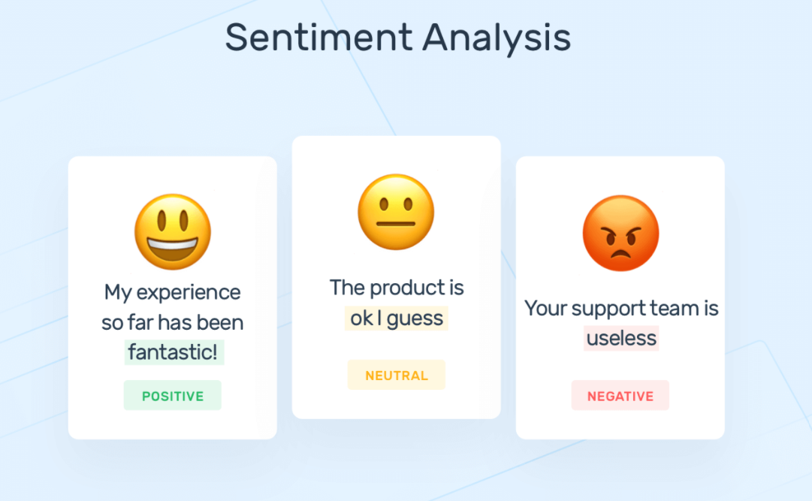{.lightbox fig-align="center"} 
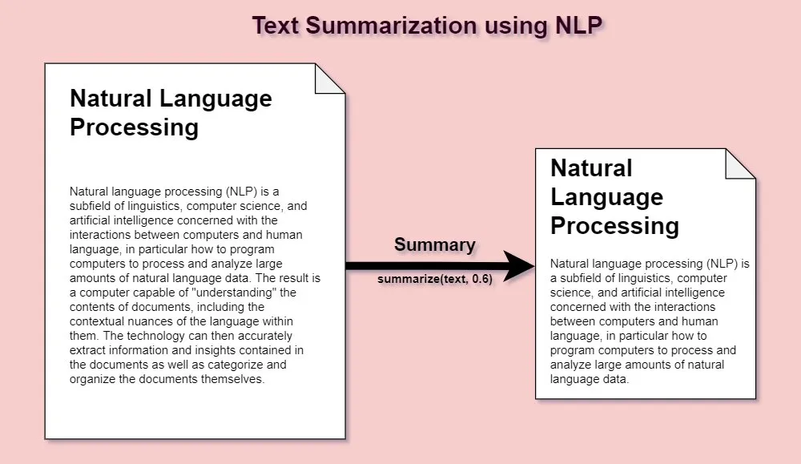{.lightbox fig-align="center"} 
:::
::: {.column width="40%"}
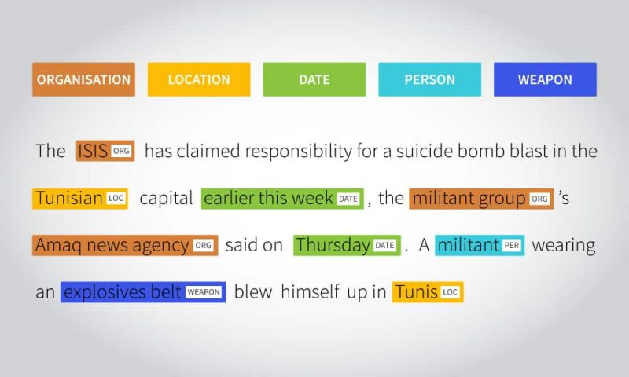{.lightbox fig-align="center"} 
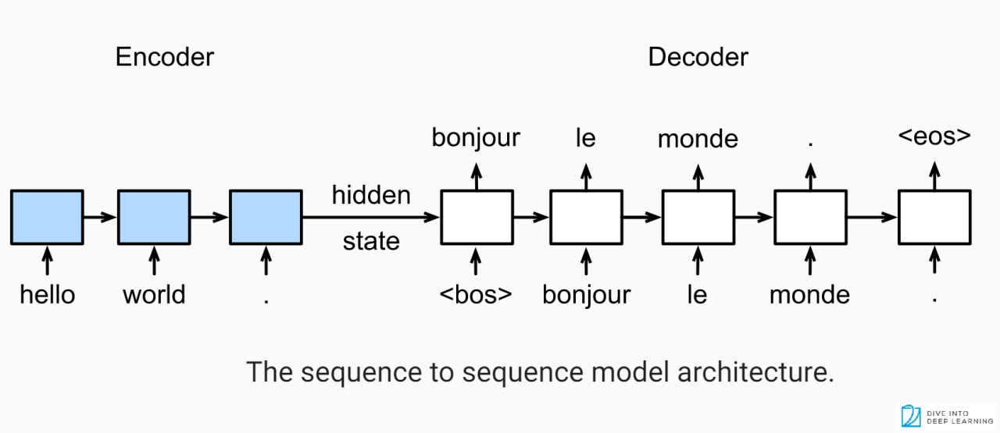{.lightbox fig-align="center"} 
:::
::: {.column width="30%"}
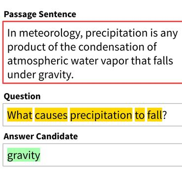{.lightbox fig-align="center"} 
:::
::: 

## Speech Recognition

Dada la naturaleza secuencial del lenguaje, el contexto ayuda a interpretar cuál es la manera correcta de interpretar el sonido emitido.

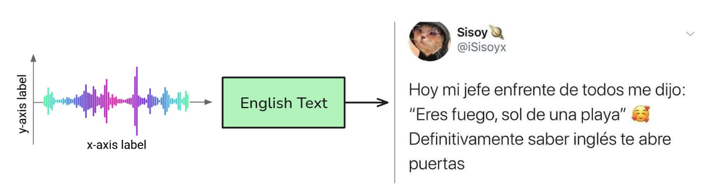{.lightbox fig-align="center" } 

::: {.callout-important appearance="default" icon="false"}
## El problema
¿Cómo hacemos que una red neuronal entienda y procese el texto?
:::

## Proceso de Tokenización y Embedding {.smaller}

::: {.columns}
::: {.column}
::: {.callout-tip appearance="default" icon="false"}
## Tokenización

El proceso de Tokenización permite transformar texto en datos numéricos. Cada dato numérico se mapea con un "trozo de texto". Normalmente los modelos van asociados a la tokenización con la que fueron entrenados. Cambiar la tokenización puede generar gran degradación.
:::

::: {.callout-note appearance="default" icon="false"}
## Embedding
Corresponde el proceso en el que los Tokens se transforman en vectores densos en las cuales la distancia entre ellos representa una noción de similaridad.
:::
::: {.callout-important icon="false"}
* En este caso la frase ***"Frog on a log" *** es separada en Tokens (en este caso cada token es una palabra). 
* Luego cada Token es mapeado a un Token id proveniente de un vocabulario. ***¿Qué es un vocabulario?***
* Los embeddings en este caso representan una secuencia de largo 7 con 3 dimensiones.
:::
:::
::: {.column}
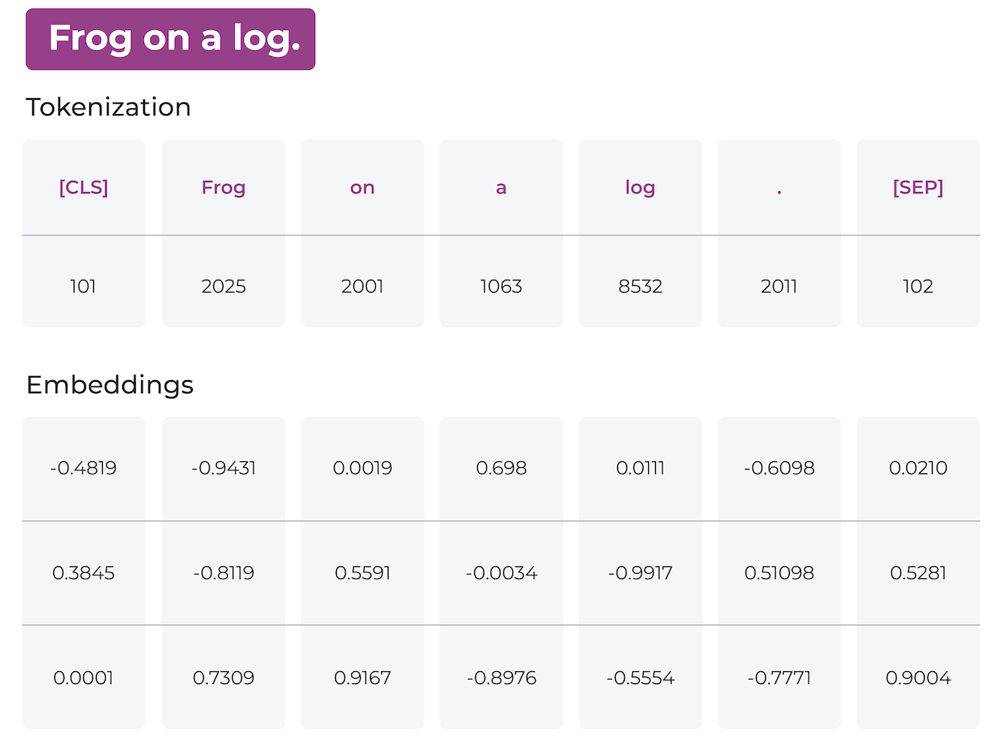{.lightbox fig-align="center"} 
:::
::: 

## Embeddings {.smaller}

{.lightbox fig-align="center" width="80%"} 

::: {.callout-tip appearance="default"}
## ¿Por qué es tan importante el uso de Embeddings?
* Primero porque son entrenables. Es decir la red puede aprender cuál es la mejor manera de representar palabras.
* Existen embeddings pre-entrenados, es decir, se puede hacer transfer learning de embeddings.
* La red puede aprender relaciones semánticas entre palabras, algo imposible utilizando otras representaciones.

:::

## Un tensor de Texto {.smaller}

::: {.columns}
::: {.column}
#### Tokenización

Suponiendo un Tensor de Entrada que representa 4 frases de 6 Tokens cada una:
```{.python}
X = torch.tensor([[42, 67, 76, 14, 26, 35],
        [20, 24, 50, 13, 78, 14],
        [10, 54, 31, 72, 15, 95],
        [67,  6, 49, 76, 73, 11]])
print(X.shape)
```
```
(4, 6)
```
::: {.callout-tip appearance="default" icon="false"}
## 👀 Una palabra no necesariamente es un solo Token. [Ver acá](https://tiktokenizer.vercel.app/?model=meta-llama%2FMeta-Llama-3-8B)
:::

::: {.callout-important appearance="default" icon="false"}
## 🚨 La tokenización depende del vocabulario utilizado. La Tokenización va de la mano con el embedding y con el modelo a utilizar.
:::
:::
::: {.column}
#### Embedding
```{.python}
emb = nn.Embedding(100, 3)
output = emb(X)
print("Shape de un Embedding:", output.shape)
output
```
```
tensor([[[-1.4391,  0.5214,  1.0414],
         [-0.8293, -1.0809, -0.7839],
         [ 0.6427,  0.5742,  0.5867],
         [-1.0759,  0.5357,  1.1754],
         [ 0.2191,  0.5526, -0.6788],
         [ 0.5069, -0.4752, -0.4920]],

        [[-0.5644,  1.0563, -1.4692],
         [-0.1976,  1.2683,  1.2243],
         [-0.5855, -0.3900,  0.9812],
         [-0.4459, -1.2024,  0.7078],
         [-0.9109, -0.5291, -0.8051],
         [-1.0759,  0.5357,  1.1754]],

        [[-1.3864, -1.2862, -0.8371],
         [-1.4510, -0.7861, -0.9563],
         [ 0.2332,  4.0356,  1.2795],
         [-1.5754,  2.2508,  1.0012],
         [ 0.5612, -0.4527, -0.7718],
         [ 0.3714, -0.0047,  0.0795]],

        [[-0.8293, -1.0809, -0.7839],
         [ 1.5736, -0.8455,  1.3123],
         [ 1.1179, -1.2956,  0.0503],
         [ 0.6427,  0.5742,  0.5867],
         [ 1.3642,  0.6333,  0.4050],
         [-0.9224,  1.8113,  0.1606]]])
```
:::
::: 

## Tokens Especiales {.smaller}

Cada modelo puede incluir el tipo de Tokenización que más le acomode. Además cada tokenización suele incluir tokens especiales que ayudan a la red a entender mejor el contexto o a resolver problemas intrínsecos del modelamiento de secuencias. Algunos de estos Tokens especiales son:

* <PAD> : Token utilizado para rellenar secuencias más cortas y que todas tengan el mismo largo.
* <SOS> <BOS> : Start of Sequence/Beginning of Sequence. Token que indica el inicio de una secuencia. 
* <EOS> : End of Sequence. Token que indica el final de una secuencia.
* <UNK> : Unknown Token. Token utilizado para representar palabras fuera del vocabulario.
* <MASK> : Token utilizado en tareas de Masked Language Modeling (MLM) para indicar palabras que deben ser predichas por el modelo.
* <SEP> : Separator Token. Utilizado para separar diferentes partes de una secuencia, como en tareas de preguntas y respuestas.
* <CLS> : Classification Token. Utilizado en tareas de clasificación para representar toda la secuencia.

::: {.callout-caution appearance="default" icon="false"}
## 🚩 Ojo
Exiten tantos tokens especiales como tokenizadores y modelos existen. Siempre revisar la documentación del modelo a utilizar. Algunos también indican roles como por ejemplo en el caso de un asistente, se indica el rol del asistente, del usuario, y prompts de sistemas. 
:::

## Problema de las RNN comunes {.smaller}

::: {.callout-warning}
A pesar de las habilidades de las RNN, estas no son suficientes para distintas tareas de NLP.
:::

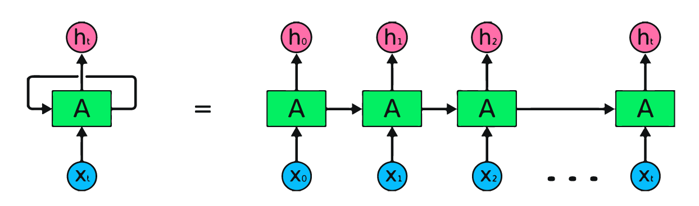{.lightbox fig-align="center"} 

Las RNN inicialmente toman cada elemento de una secuencia y generan un output para cada entrada. Esto genera ciertas limitantes en tareas como Machine Translation, donde por ejemplo, el modelo asume que la traducción es uno a uno, lo cuál no es necesariamente cierto.


## Machine Translation: Ejemplo del Inglés {.smaller}

Supongamos que necesitamos hacer la siguiente traducción:

Inglés 
: > Hi, my name is Alfonso

:::{.fragment}

Español
: > Hola, mi nombre es Alfonso

::: {.callout-note}
Este tipo de traducción es uno a uno. Cada input puede tener asociado una salida de manera directa puede realizarse de manera directa con una RNN.
:::
:::

## Machine Translation: Ejemplo del Inglés {.smaller}

Inglés
: > Would you help me prepare something for tomorrow?

:::{.fragment}
Español
: > ¿Me ayudarías a preparar algo para mañana?

::: {.callout-important appearance="default" icon="false"}
# ⛔ Problemas

* La traducción no es uno. De hecho en inglés se utilizan 8 palabras y 1 signo de puntuación. En español se traduce en 7 palabras y 2 signos de puntuación.
* *"Would"* no tiene equivalente en español. 
* *"a"* no tiene equivalente en el inglés. 
* *"Me"* se traduce como *"me"* en inglés pero en vez de ir al inicio, va continuación de *"help"*.
* "*¿*" no existe en inglés.

:::

::: {.callout-warning appearance="default" icon="false"}
## 🔔
* Otros idiomas como el Alemán o el Ruso, tienen fusión de palabras o declinaciones que hacen la traducción mucho más difícil. 
* Es por ello que se requiere una cierta libertad entre los tokens de entradas y los tokens de salida.
:::
:::


## Soluciones: Redes Convolucionales {.smaller}

Una potencial solución se puede dar por medio de Redes Convolucionales de 1D. En este caso las redes convolucionales tienen la ventaja de poder mirar tanto al pasado como al futuro de manera móvil.

::: {.columns}
::: {.column}
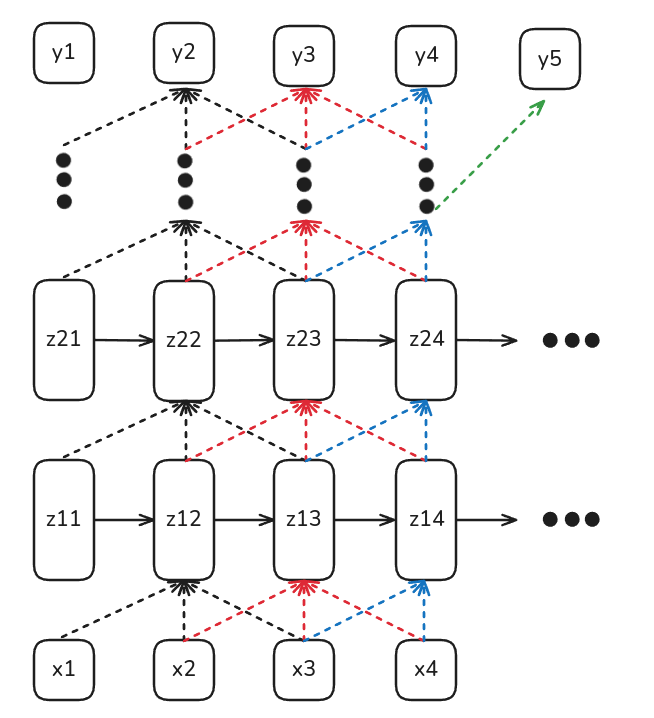{.lightbox fig-align="center" width="80%"} 
:::
::: {.column}
::: {.callout-note appearance="default"}
## Ventajas
* Pueden tomar contexto desde el inicio y desde el final.

:::
::: {.callout-important appearance="default"}
## Desventajas
* Su campo receptivo es mucho más acotado y depende del número de capas y el largo del Kernel lo cual repercute directamente en el número de parámetros del modelo.
* No tienen estado latente (o memoria) que almacena contexto.
* No es útil para modelos de generación (ya que ve contexto desde el futuro).
:::
:::
::: 

## Soluciones: Arquitecturas Encoder-Decoder {.smaller}

Encoder
: Corresponde a una arquitectura que permitirá tomar datos de entrada y codificarlos en una representación numérica (normalmente como hidden states, embeddings o logits).

Decoder
: Corresponde a una arquitectura que toma una representación codificada de datos (normalmente generado por un encoder) y la transforma nuevamente en una salida con un formato comprensible y no solamente una "simple etiqueta".

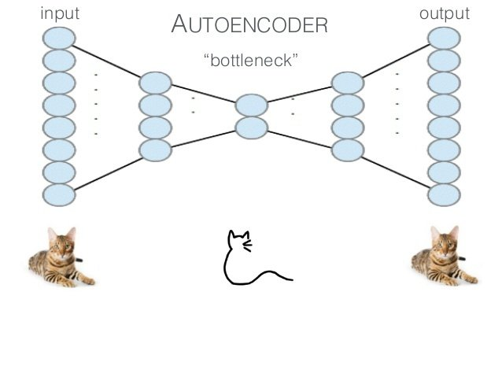{.lightbox fig-align="center"} 

::: {.callout-note}
Este tipo de arquitecturas son quizás las más populares hoy en día y tienen aplicaciones en distintos dominios.
:::

## Soluciones: Arquitecturas Encoder-Decoder {.smaller}

::: {.callout-note}
Una arquitectura Encoder-Decoder convolucional permite devolver una imagen como salida. Este ejemplo se conoce como Segmentación Semántica.
:::

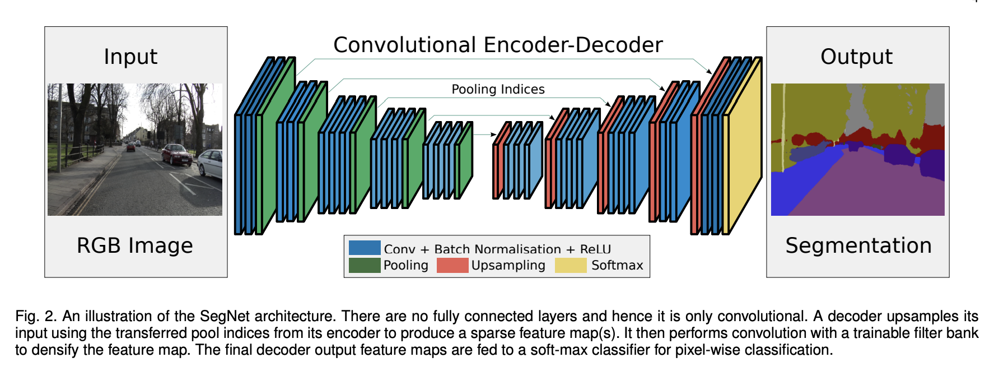{.lightbox fig-align="center"} 


## Soluciones: Arquitecturas Encoder-Decoder {.smaller}

::: {.callout-note}
Una arquitectura recurrente permite devolver una secuencia como salida. La cual puede utilizarse para generación o traducción de texto.
:::

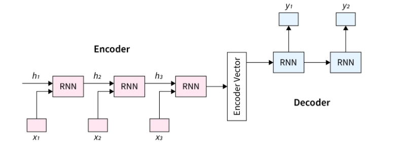{.lightbox fig-align="center"} 

::: {.callout-note appearance="default" icon="false"}
## Ventajas
* Permite "desligarse" de la predicción uno a  uno. El Encoder resuelve una tarea many (la secuencia) to one (un hidden state) y el Decoder resuelve una tarea one (hidden state) to many (secuencia de salida).
* La salida de este tipo de modelos depende principalmente del contexto almacenado en el Hidden State/Bottleneck.
:::

::: {.callout-important appearance="default" icon="false"}
## Desventajas
* Dado los problemas de Vanishing/Exploding Gradients es ingenuo pensar que todo el contexto de una frase vive en el último hidden state.
* Aún así, son una buena primera aproximación al problema.
:::

## Soluciones: Arquitecturas Encoder-Decoder {.smaller}

{.lightbox fig-align="center" width="80%"} 

::: {.callout-important appearance="default" icon="false"}
## Ojo
El último Hidden State del Encoder se utilizará como Hidden State inicial del Decoder.
:::


## Entrenamiento
## Teacher Forcing {.smaller}
## Padding
### Beam Search 
### Greedy Search {.smaller}


# Eso sería por hoy 😊

::: {.footer}
<p xmlns:cc="http://creativecommons.org/ns#" xmlns:dct="http://purl.org/dc/terms/"><span property="dct:title">Tics-579 Deep Learning</span> por Alfonso Tobar-Arancibia está licenciado bajo <a href="http://creativecommons.org/licenses/by-nc-sa/4.0/?ref=chooser-v1" target="_blank" rel="license noopener noreferrer" style="display:inline-block;">CC BY-NC-SA 4.0

</a></p>
:::
